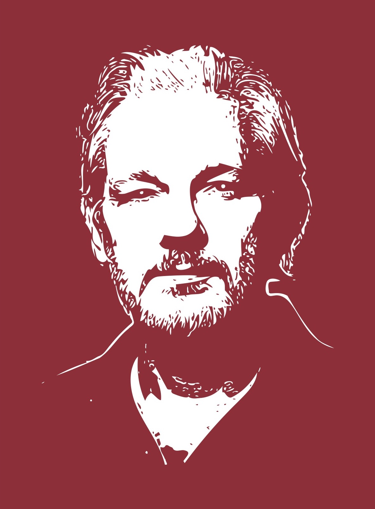

---
author:
- |
  Claudia Latour / Martin Sonneborn\
  **Assange**
date: 2nd edition, revised & updated. Now even more depressing. Smiley!
title: Circular 1 - Drucksache 1
---

# Preface {#preface .unnumbered}

::: Large
Dreamworks and Universal have failed to produce a concise manuscript on
the life of Julian Assange, as have the New York Times and the Guardian.

So have we.

Take what has now emerged as a plea for democracy & civil rights (using
the example of a publicist and platform founder), for a free society,
free press and free information.

Or as a declaration of sympathy for the WikiLeaks project - and
antipathy for all those who fight it.
:::

::: flushright
::: small
**Editor**\
Martin Sonneborn\
Non-attached Member of the European Parliament\
Rue Wiertz 60\
1047 Brussels\
Belgium

2nd edition, updated and revised (A.d.H.s: #wise?). Now even more
depressing. Smiley! The opinions expressed are the sole responsibility
of the authors and do not necessarily reflect the official position of
the European Parliament.

Original German source\
<https://martinsonneborn.de/assange/>

This english version has been typeset using LaTeX and has been fully
translated by DeepL.com.\
A BIG THANK YOU to <https://deepl.com/> for the FREE service (This is
NON-COMMERICAL, EDUCATIONAL USE!).

English document sources
[https://github.com/schnoddelbotz/free-julian-assange](https://github.com/schnoddelbotz/free-julian-assange/raw/main/Translation-Sonneborn/brochure_en.pdf)

*Document revision 6b097e8 - Generated Thu Jun 16 02:25:53 CEST 2022*
:::
:::

::: multicols
2

::: epigraph
„Das Politische kann, wo Menschen leben, nicht verschwinden."   "The
political can, where humans live, not vanish."

*J. Habermas*
:::

# More Being than Appearance

It is one of the findings that should not be new to an observer
untrained in jurisprudence and jurisdiction. that the REALITY of a legal
PROCEDURE sometimes has little to do with the REALITY of the underlying
(LAW). REALITY of the (LAW) CASE on which it is based. CASE has to do.
Especially not with the THESE in turn underlying ACTUAL CONDUCT. And
least least with the socio-political and democratic-practical REALITY,
which is concentrated in ALL THAT.

If the REALITY of a JUDGMENTAL NEGOTIATION is divorced from its
overriding MEANING, from its triggers, reasons, causes, intentions,
goals & consequences - and thus from the basically basically negotiable
POLITICAL CORE - completely in order to be able to live in the absurd
SHINING REALITY of a pseudo-territory enclosed by legal (in unstoppable
madness) in front of oneself, then one is then one finds oneself in the
appeal procedure around the extradition of the WikiLeaks founder Julian
Assange.

Possibly, those who for centuries have been driven by nothing by nothing
but their sheer existence of our JUSTICE SYSTEMS have now in the end
been by these (self)destructive offshoots of late modernity. modernity -
and that in spite of all their HISTORICITIES, no matter how obtrusively
displayed. despite. This is of course all the more true for Great
Britain's Magna Carta and its real-wood paneled walls, Victorian velvet
curtains, emerald-green banker's lamps (Art Deco) and (well-powdered)
judge's wigs.

Against the striking backdrop of such \"legal traditions\" in the social
subsystem of the administration of justice and ARGUMENTATION PATTERNS
have long since arisen in the social subsystem of the administration of
justice, which (in strange self-referentiality and the most stupid
internal symbolism) so stubbornly their OWN OWN LIFE, that they are not
able to deal with socially relevant questions, conditions and
implications are actually no longer remotely connected.

**Like the whole document - This chapter was translated with
[www.DeepL.com/Translator](www.DeepL.com/Translator){.uri} (free
version)**

# „Yeah, why not?"

On 27 and 28 October 2021, in London, we will attend a trial in which
the REALLY NEGOTIABLE, which has NEVER only affected Julian Assange
himself, but always ALL OF US, is not even TALKED ABOUT. The (since
1066) meticulously rehearsed rules of procedure want it that way. That
here not the big picture ITSELF, but only its legally permissible WRITS
are up for negotiation. With which not the great whole ITSELF, but only
the PARTS of a society which are affected by THIS (s)he parts of a
\"reality\" produced by legal means.

And so it actually happens that on a full two days of hearings at the
highest British court, the London High Court, the MAIN QUESTION
concentrated in the Assange case does not even arise. Which of course is
still whether a supposedly democratic constitutional state can misuse a
100-year-old US (anti-)espionage law, in order to - assisted by
tradition-saturated judiciary apparatuses of friendly states under the
rule of law (in the old European world) in a thousand-year chase of
unprecedented Australian publicist so thoroughly that the only thing
that could that the example made of him alone - because of the CRIMINAL
EFFECT it has had investigative journalism of a Fourth Force, which even
Fourth Force that is even remotely worthy of the name will henceforth be
permanently prevented.

The British district court in which Australian publicist Julian Assange
after a Kafkaesque cascade of prosecutorial (and governmental) cascade
of prosecutorial (and governmental) manoeuvres last year, the British
District Court had question in January this year with a disturbing
\"YES, WHY? NOT?\", in what was the biggest democratic SCANDAL in the
history of democracy.

The first instance proceedings were (somewhat surprisingly) conducted by
a bland District Judge named Vanessa Barrister. (District Judge by the
name of Vanessa Baraitser, at the time the most the most undistinguished
figure in the British judiciary at the time. had to offer. Neither her
professional background, nor her curriculum vitae, nor an overview of
the cases she had heard were publicly known. of the cases she tried -
not even a blurred photograph. The average owner of a rural of a rural
carwash had left more evidence of her actual more evidence of her actual
existence than Vanessa Baraitser Vanessa Baraitser, noted British
ex-diplomat Craig Murray[^1].

A handful of small claims cases had probably been assigned to her,
exciting enough for the traditionally excitable (British) local press,
after all: Sexual sexual harassment by and with police officers,
provincial politicians with a penchant for surreptitious mobile phone
snaps among pre-crossing skirt wearers, that sort of thing. Stuff. In
ten years of district court practice, Baraitser had heard a single
extradition case:

France's request for the rendition of a businessman (Alexandre Djouhri)
implicated in state corruption surrounding ex-president Nicolas Sarkozy.
The The matter was clear, Baraitser had approved it.

And now the Assange case.

# Real criminal shit

Before anyone makes any judgement about Julian Assange, he should remind
himself once again who (and what) he is who (and what) they are actually
dealing with. they are dealing with.

Diligent statisticians have calculated that in ten years the small group
of activists around WikiLeaks have published TEN MILLION secret
documents in ten years. in ten years. More than the entire world press,
since the entire world press has even existed. Documents about war
crimes, human rights violations, torture, violence, kidnappings, illegal
surveillance, espionage, manipulation of opinion and environmental
crimes.

Relevant publications include diplomatic and military secret papers (of
leading belligerent states) as well as documents to make visible the
modus operandi of socio-economic organisations and individual actors.
organisations and individual actors - (lying) governments,
(power-obsessed) party apparatuses, (corrupt) politicians (corrupt)
politicians, (unsympathetic) entrepreneurs, (arsehole) corporations and
(notorious) egomaniacs, (Swiss) (Swiss) banks, (offshore) fraudsters,
(profit-fixated) nature destroyers and finally political (\"Hillary\")
and religious (\"Scientology\") sects. WikiLeaks publications were never
an end in itself, but a means to achieve a deeply of a profoundly
democratic goal, which - borne out of and social ideal[^2] - is based on
the (incontrovertible) conviction that a FREE that a FREE SOCIETY can
only be based on FREE INFORMATION.

In the WikiLeaks project, the fundamental question of modern democracies
is condensed, namely that of the LEGITIMACY of state, intelligence and
military information monopolies.

WikiLeaks is asking questions that every responsible citizen[^3] should
ask himself and his democratic and his democratic representatives (and
uncles): Does a government have the right to (with the aim of retaining
power or enriching itself) override the law? Does an intelligence
service have the right to violate the privacy rights of citizens? of
citizens it has been appointed to protect? Does a military have the
right to violate human rights or principles of international law? And,
if so, do these organisations also have the right to conceal violations
from the public through secrecy?

Assange, a multi-award-winning journalist and publisher, has been
publisher, has been held without legal grounds in the UK's maximum
security Belmarsh prison since April 2019 - along with terrorists and
serious criminals, serial killers, sex offenders, Islamists, right-wing
extremists, IRA fighters, and Christoph Waltz, who was as Ernst Stavro
Blofeld, last used his bionic eye from here to execute the (failed)
order to kill James Bond. to kill James Bond. Belmarsh is the British
Guantanamo, a strictly geometric breeding facility with clinically white
interior cells, a place that has been given the (aptly) nicknamed
HELLMARSH. Here sits the WikiLeaks founder has been held in solitary
confinement for 30 months despite repeated statements by the United
Nations (and others) that he is a victim of arbitrary, illegal detention
and psychological torture. There are, must be made clear time and time
again that there is NO LEGAL BASIS for the detention of Julian Assange.
There is nothing whatsoever against him.

*Subjective note from Ross Kemp. After watching parts of the documentary
\"Welcome to HMP Belmarsh\", for which actor for which actor Ross Kemp
(\"EastEnders\") was granted filming and access to the high security
prison, we are almost a little relieved that Assange is at least housed
in a single room. at least in a single room. And we are appalled, really
stunned, that he should be deprived of his of his liberty to force him
into a place like this to a place like this without any legal basis.
Ross Kemp is a man like like a living room cupboard, and he's pretty
tough. All over the world he has worked among criminal street gangs, in
Afghanistan, Papua New Guinea and who knows what else as an \"as an
embedded journalist without batting an eyelid. without batting an
eyelid. When he enters \"The Box\", the prison's high-security unit, and
the door closes behind him, he is on the edge of his seat. closes behind
him, he is in the most oppressive place in the whole world, he says.
whole world, he says. There is no bed, no sink, toilet, no window, no
access to water or air. to air. \"You feel you are completely alone. I
don't think I don't think I could spend an hour in here without going
insane.\"*

In the first-instance proceedings concerning his extradition District
Judge Baraitser had stubbornly refused to allow any of the refused to
even take note of any of the obvious facts. of the obvious facts - from
the genuinely JOURNALISTIC nature of WikiLeaks' publications to the
recognisably POLITICAL nature of the accusations against its founder, to
the obvious (to the blind, really) prospect of an unfair trial in the
USA.

Assange would be tried in ALEXANDRIA in the US state of Virginia, where
he would have to face a secret trial in a special court with a grand
grand jury. In the immediate vicinity of this Washington and Langley,
are the Pentagon, the Defense the Pentagon, the Defense Intelligence
Agency, the FBI, the CIA, the NSA, and the headquarters of other
military, security and intelligence agencies of the United States. The
population structure of Alexandria is is about as far from an average
urban population as this ridiculous trial is from the rule of from the
rule of law. Between 80 and 90 per cent of Alexandria's residents of
legal age, among whom the lay lay judges in the Assange trial would be
recruited are representatives of government agencies, intelligence
services or the US military, and have a direct, indirect or (at least)
economic relationship of dependence on the US government. relationship
of dependence on the US government. Grand juries in the relevant
judicial district are so reliably one-eyed, one-eared, one-sided, biased
and prejudiced that they cannot seriously be expected to render an
objective verdict - the burden of loyalty to the government is crushing.
In the long the Eastern District Court of Virginia, there has there has
never been a single case in which the grand jury has grand jury
acquitted a defendant brought by the national security agencies. Truly
never.

*Subjective note from heise.de US legal associations such as the
American Association of Jurists (AAJ) and the Center for Constitutional
Rights (CCR), together with legal institutions and jurists working
internationally, have written a letter to the British Prime Minister.
have written a letter to British Prime Minister Boris Johnson and his
government to dissuade him from extraditing Julian Assange to the US.
Julian Assange from being extradited to the USA. A Such a move would, in
their view, be illegal: \"Extradition would be unlawful because the
protection of Mr. of Mr Assange's fundamental due process rights in the
is not guaranteed in the USA. Mr Assange will be tried before the
notorious \"spy court\" of the Eastern District of Virginia (in
Alexandria, the author), before which no accused before which no
national security defendant has ever succeeded. ever succeeded. Here, he
faces a secret trial before a jury selected from a population in which
most of the population in which most of the persons eligible for jury
eligible for jury selection work for the CIA, NSA, DOD or DOS (The
Central Intelligence Agency, The National Security Agency, U.S.
Department of Defense, U.S. Department of State) work for or are
affiliated with.*

# „Reeeevenge!" (Fatty Pompeo)

The United States of America was not aware of Assange's the publication
of the materials (meticulously kept under wraps by the materials on the
wars in the IRAQ and AFGHANISTAN. IRAQ and AFGHANISTAN, at the latest
with the publications on human rights violations in the Guantanamo Bay
prison camp. stepped[^4].

Under Barack OBAMA, the USA had still refrained from not out of
philanthropy, but because of a tangible definitional dilemma, known
among lawyers as the \"New York Times problem\". \"New York Times
problem\". It goes something like this: how can Julian Assange be
prosecuted for publishing classified material (on the pages of the pages
of WikiLeaks) - BUT NOT the editors of the editors-in-chief of the New
York Times, on whose pages said EXACTLY THE SAME THING? Or the editors
of The Guardian, Le Monde, El Pais, Corriere della Sera, Süddeutsche
Zeitung or Der Spiegel?

Lest a false impression be created here (by mistake) Under the Obama
administration, the US intelligence and judicial authorities have, of
course, also taken action against Assange. In 2011 the FBI carried out a
large-scale infiltration operation against WikiLeaks in Iceland,
recruited a paedophile as a false witness and - in preparation for an
indictment - had already selected the appropriate grand jury. and - in
preparation for an indictment - has already convened the appropriate
grand jury. The only thing that has been postponed for the time being is
the proceedings have been postponed, and this only on the urgent advice
of lawyers who (in the White House) had suddenly remembered the contents
of the \"First Amendment\".

The subtle legal philosophers around Donald TRUMP didn't give a damn
about the lack of distinction (between publicists and publicists). ass.

In 2017, WikiLeaks had revealed the (disturbing) capabilities of the
American of the American secret service to electronic surveillance and
cyber warfare. The so-called \"Vault 7\" leak was the \"biggest\" and -
according to the New York Times - really also the \"most the \"most
embarrassing\" data leak that had ever happened to the CIA - or any of
its agency heads. For the then CIA chief (and later Secretary of State)
Mike Pompeo it may (or may not) have been a (narcissistic) slight. (or
not). In any case, it was the trigger for a (private) vendetta against
the US that has since been carried out (private) vendetta against
WikiLeaks and Julian Assange. Fatty Pompeo wanted ACHIEVEMENT. And
officially declared WikiLeaks a \"hostile non-state intelligence
agency\". - a neologism every bit as crude and malicious as its
inventor, and one that no serious constitutional lawyer has ever heard
of before (or since). [^5].

With Trump and Pompeo behind it, the US Justice Department finally
brought its audacious indictment of Julian Assange. The writ covers 18
points (that's more than a western European ladybird has) and and, if he
is extradited, it offers him the prospect of 175 years in prison - ten
years for each of the 17 counts under the Espionage Act and a further
five for the 18th count on which he was convicted. for the 18th, which
charges him with attempting to hack into a government computer, an
offence under the Computer Fraud and Abuse Computer Fraud and Abuse Act.

Again, as a reminder, NONE of the US war criminals proven to have been
at large in Iraq, Afghanistan or Guantanamo have been innocent,
civilians, or children. tortured, tortured and murdered innocent people,
civilians, children, was ever held accountable for his crime. ever been
held accountable, charged or tried for his crime. tried. They are all at
large. Accountable The one who should be held accountable, charged and
brought to justice is the one here is the one who made their crimes
public.

The United States essentially relies on the Espionage Act, a law passed
in 1917, developed under World War II conditions for World War II
secretaries and World War II information of World War II military
sensitivity - where did General Custer's division park its howitzers?
This \"legal basis\" alone, dug up in the absence of a plausible,
justiciable (or otherwise valid) accusation of an offence, should give
every European who has mentally outgrown the PRE-MODERNE (thorough) food
for thought. think. The attempt to make an obsolete law of war more than
100 years later against a foreign publicist completely out of context
[^6], corresponds to the cute idea of the madman from the Bosporus, a
contemporary satire by Jan Böhmermann with the Reichsdeutsche
Majestätsbeleidigungsgesetz (Imperial German libel law) (anno 1871).
Both are already so absurd at first glance that there is no need for a
more long-winded commentary. We hold: There is no legal basis to
prosecute an Australian journalist under the Australian journalist under
the US Espionage Act. under the US Espionage Act.

The US prosecution is not only completely out of time and absolutely
absurd, it is also genuinely unconstitutional, because it criminalises
core journalistic journalistic core activity and thus abrogates
centuries-old legal principles, first and foremost that of freedom of
speech and, of course, that of the freedom of the press.

# Ping, Pong & Psychology

Nevertheless, after several weeks of trial, District Judge Baraitser had
taken the ludicrous view that Assange's extradition was not prevented by
the OPENLY INCREDIBLE nature of an indictment constructed with
proto-legal dodges. of a bill of indictment constructed with proto-legal
dodges, but only - Tätärääää! - the after seven years of isolation in
the Ecuadorian Embassy embassy and another two and a half years of
unlawful imprisonment (rather unsurprisingly). the mental condition of
the unjustly detained prisoner. unjustly detained prisoner. Supplemented
by his suicidal tendencies, which were exacerbated by the world-renowned
conditions of imprisonment in the USA and its habitual bestiality.

According to Baraitser's judgement, Assange is in a precarious mental
state which, in view of the \"harsh conditions\" of the inhumane
conditions\" of the inhumane US prison system, which could \"cause him
to commit suicide\". to commit suicide\". Rule, Britannia.

In doing so, Baraitser's judgement leaves out the hair-raising \"legal
grounds\" of the USA, which a REAL FANGIRL of the of the British Rule of
Law, which should have been artfully fatally left completely untouched -
and by not explicitly rejecting it, implicitly confirms its
admissibility. That's really crass. Even more even more crass is the
fact that her judgement shifts the negotiating process from the
BATTLEFIELD of PRESS FREEDOM, which of course concerns all democrats and
citizens and people of the world, to the level of an individual
SHOCKSHIP, in which precisely the big picture of an endangered social
order no longer plays a role, but only the technical and interpretative
details of medico-psychological reports.

This alone was and is (without any doubt) a scandal of the rule of law.
And a multiple one at that. Hugh.

A FURTHER one is now added by the fact that the (downstream) proceedings
here are caught in the tightly woven net of the framework of reasons
given by the first instance - and the and the judicial discussion is
almost entirely based on the inexhaustibly vague the inexhaustibly vague
(& furthermore reliably personality-infringing) field of PSYCHOLOGY.

And so it is indeed the case that the lawyer's in the most important
legal dispute on the freedom of the press of the present day, is a PING
PONG of insinuations without of insinuations without substance,
kitchen-sink psychological conjectures and their expert refutation.
PRESENTED by James Lewis (in the the role of PING), an accomplished gun
dog of the Crown, who here, of course, is not in the service of His
Majesty but of highly unsubtle complainants from the USA. And WIDERLEGED
by Edward Fitzgerald &. Mark Summers (Team PONG), two human rights
lawyers clearly under clearly underchallenged with such nonsense.

Should the Encyclopaedia Britannica ever have an entry on the term
\"grotesque dysfunctionalities of archaotraditional legal systems\", we
would have a knot in the a knot in our handkerchief that we will
certainly never forget. ever forget. Knot is in the handkerchief, you
birds. Knot is in the handkerchief. You birds.

# In the wood-panelled heart of power

The Royal Courts of Justice courthouse in the centre of London is an
awe-inspiring place full of secular secular sacredness and all-wood
courtroom miniatures. Here - after the last reform of 1873 (LISTEN,
LISTEN!) - not only the most important common law common law courts,
including the Supreme and the Court of Appeal, but also in a tiny
dressing room called COURT ROOM FOUR[^7] so also said prosecuting
counsel James Lewis (wig: longhair, goat) as well as Edward Fitzgerald
(longhair, steed) and Mark Summers (longhair, fake), the defence lawyers
for Julian Assange (longhair, real).

Their raven black gowns reach down to the tips of their respective
footwear, which - at least after a few pints - could turn out to be a
potentially breakneck tradition. At the latest since the student
movement at the latest, it should be common knowledge what under the
talars is usually so hidden, here it's all 300 years old. His dirty grey
the fine London legal profession owes its dirty grey wigs not even to a
self-determined or Boris Johnson, but (on the contrary) to a pirated
continental European copy of King Charles II. Charles II, who imported
the idea of producing hand-knotted secondary hairstyles in 1660 from
France, of all places. (Get Brexit done, folks, all right. Or in the Or
in the words of Monty Python: \"I don't want to talk to you any more to
talk to you any longer, you overgrown English fresh beer drinker! I'll
fart on you, you swine priests! If it's up to If it's up to me, you
won't get into the European Community!\")

Presiding over the lawyers are Lord Justice Sir Timothy Victor Holroyde
(robe, short hair, black face mask) face mask) and Lord Chief Justice of
England and Wales Wales Lord Ian Duncan Burnett, Baron Burnett of Maldon
(robe, short hair, maskless). Whether the coronavirus still exists in
Great Britain in October 2021 or not or not in the UK in October 2021
is, on the face of it. somewhat contradictory. The pubs on the island
pubs (and all their patrons) have long been in agreement on this which,
from the point of view of a continental European, is a surreal, but by
no means unpleasant, reminiscence of a time of a time when coronae still
meant the circular surface structures the circular surface structures of
distant planets.

Either way, the supreme guardians of Her Majesty's legal system take
their seats on eccentric red upholstered armchairs, everyone else in the
plebeian-proletarian wooden class, furnished with the most medieval
benches EVER possessed by man since the beheading of Ann Boleyn. She
alone, of course, a physical torture as spartan as it is subtle, quite
befitting the nastiest colonial plunderers of all time[^8].

On the wooden class benches of the courtroom gallery Assange's father
John Shipton, his fiancée Stella Moris, the current WikiLeaks
editor-in-chief Kristinn Hrafnsson, and WikiLeaks ambassador Joseph
Farrell - along with the handful of journalists and trial and trial
observers who made it into the VIP section of this visitors' gallery.
Incidentally, via a spiral staircase inside a narrow torture tower.
inside a narrow torture tower AND past a taciturn courtroom court
billeteuse.

# Who is there - and who is not

For whatever reason, access to the Public Gallery had initially been and
drastic quota system, before KAIROS, the god of the opportune moment,
gradually took over in the course of two days of negotiations. the god
of the opportune moment. Whoever put on the right face the right face at
the right place at the right time[^9] was let in. \"Let me through, I am
the EU.\" Those who don't, don't. There would have been room for 100
people, if the taciturn billeteuse hadn't asked for a good a dozen or
so, for whatever reason, the heavy court door the heavy courtroom door
creaking shut behind her.

A dozen seats for the interested public. For a trial in which the
interested public itself is up for disposition.

All other observers of the trial, mainly representatives of somewhat
insignificant-sounding media, must the trial by video transmission from
a remote courtroom - via screens on which nothing can be seen, and
loudspeakers. screens from which nothing can be seen and loudspeakers
from which from which nothing can be heard. A further 80 journalists
from around the world show signs of interest this time by tuning in via
a video link. by tuning in via a video link.

Most of them have not even travelled to the event because the British
judiciary had not been able to grant them access. had not been able to
guarantee them access to the courtroom. Members of the press received
conflicting messages, and for months the court clerk in charge, an
unnamed court clerk had been on holiday for months (for a long time) or
ill (seriously), moved, injured or deceased (unexpectedly), and had
therefore not even responded to enquiries - certainly not in a binding
manner. bindingly. Admission guarantees were categorically refused,
press accreditations not issued, access lists not kept.

Anyone who is a representative of the press and nevertheless - at
random - comes to this London courthouse is a FREAK. is a FREAK. If he
were not, he would hardly have would hardly have appeared under such
conditions. The incorruptible and undaunted director, publicist and
activist Angela Richter is here, (after all) on behalf of the feuilleton
of the WELT, the The clever Daniel Ryser from the Swiss magazine
REPUBLIK, Markus Kompa follows the events for TELEPOLIS (via laptop on a
dustbin in front of the courthouse) - and that's almost it.

Envoys of more important, higher-circulation German-language &
international media houses - or even the big news agencies themselves -
are of course not present. We assume: FOR REASONS. And confidently
assume that they would ALSO NOT have come if they had been offered
luxury suites with a private private gin fountain, diamond-studded
giveaways or the crown treasure the crown treasure of some majesty.

Major media houses are not interested in Assange, you know. in Assange,
you must know. At least not anymore. When they could still exploit his
publications for some idiotic front-page bombshells they were of course
NOT interested in him either. in him. Or for WikiLeaks. Or at least for
the principle of FREEDOM OF THE PRESS, which, although it justifies
their own existence, is nevertheless always ONLY vaguely defended by
them at its really DECISIVE POINTS. is always defended ONLY
insinuatingly.

If, instead, it has to be defended by someone, and that BOOSTINGLY with
his OWN LIFE, without the relevant media people being particularly
interested in it interested in it, then we don't really know what to do.
If the principles of democracy should be FIREABLE, we hereby consider
them to be DESTROYED.

NOT present, of course, are those - according to their
self-declaration - democracy-savvy civil rights militants from the
convoluted structures of the European Union. Not a single official
representative of the EU Parliament, not one of the thirty-two thousand
officials of the EU Commission, not one single member of any committee
on \"civil liberties\", which cannot be overestimated for \"civil
liberties or what\", not a single corrupt Croatian commissioner for
\"democracy and demography\", no commissioner for the rubble of
(European) human rights. Not a single one of these EU bureaucratic
greasepainters who usually can't wait to get can't wait to throw
themselves into some dramatic dramatic PR pose as soon as PRESS FREEDOM
or HUMAN RIGHTS are mentioned anywhere. is[^10].

As this example again shows, EU representatives are obviously less EU
representatives are obviously less concerned with the defensible
principles of press freedom and human rights themselves than with their
political instrumentalisation.

After all, the EU Parliament had only just puffed itself up collectively
in order to give a not without reason controversial, because ultimately
radical right-wing nutcase like Alexei KRAWALNY his stupid Sakharov
Prize. prize. Well, yes. In view of the series of its previous
recipients, we do not assign this poorly endowed PLASTEPOKAL to the
LOBPREIS of IRGENDWAS (human rights, democracy, freedom of the press),
but to the (currently much more fashionable) category \"hybrid
warfare\". And while the EU Parliament once a year, the EU Parliament
reliably brings into position its most severe (albeit completely
irrelevant) media- and morality-political (android) weapon. a decade, it
has still not been able to utter a word about the Assange case. No
(superficial) moral outrage, no (hollow) political demand, not even a
(meaningless or consequence-free) little comment. NOT TO THINK what
would be going on in the brains of these European value bearers and
democracy fighters if the United States of would be, if not the United
States of America, but Iran, Russia or - God forbid - CHINA demanded the
extradition of a journalist who had done nothing but truthful
information about (war-) crimes committed by these (war) crimes
committed by them. Big rhetorical fireworks, Olympic lightning bolts and
thunderbolts etc., World War III would be upon us. Good grief!

# Castorf and the living knee

Assange has been denied PERSONAL PARTICIPATION in the appeal
proceedings, which will decide the rest of his the rest of his life,
without giving any reasons. denied. A FURTHER CONSTITUTION that makes
this court session a farce. A legal system could hardly show more
clearly legal system could hardly show more clearly what it thinks of
the (humanistic) traditions it always so agonisingly invokes on high
holidays.

Assange is being negotiated, disputed and conjectured about as if he
were a commodity, a lump of LEGITIMATE MATERIAL that is not even allowed
to be sold to the Dadaist retail trade. not even allowed to tell the
dadaist retail trade about its own EXPORT CONDITIONS. The accused as an
absent object of specialised expert interest, over whom (or which) those
present in silly wigs can can dispose of at will. Habeas corpus 2.0.

It seems like an early staging idea of Frank Castorf, when blurred
moving images of the ABSTAINER at the beginning of the first day of the
trial suddenly appear appear on monitors placed lengthwise. They show
Assange in the BLUE ROOM of HMP Belmarsh, Her Majesty's Prison: eight
square metres of a padded cell, eighteen kilometres AWAY from the scene
of the local legal legal events here.

The person whose (bare) life is at stake can SAY, can say nothing here.
Nor can they laugh, scream, frown in tectonic in tectonic folds of
despair, discuss the matter with his with his lawyers, intervene in the
course of the trial. can intervene in the course of the trial. IF
Assange appears, then he appears as a LACK OF SPEECH HIS own curriculum
vitae, at the mercy of specialist lawyers' brilliance & supreme court
acts of mercy; captured (of all things) by a surveillance camera with a
deactivated microphone.

One briefly wishes there were GODS to smash it all.

This moving image feed, lasting only a few minutes, of a NEGOTIATING
OBJECTIVE DAMNED TO TOTAL PASSIVITY is perhaps the clearest metaphor for
what this process has become. has become.

It is also the document of the psychological and physical destruction of
a human being. On the day before the trial began, Her Majesty's Prison
Doctors had changed the type, dosage or cut of medicine given to
Assange. medicine, WHATEVER is understood to be medicine in a
high-security prison. in a maximum-security prison (and why WHY, WHY,
WHY, WHY, WHY, WHY, WHY, WHY, WHY, WHY, WHY of a trial). \"High dose of
medication,\" murmurs one judge. What Assange looked like has already
been described, we won't even try. try. Gaunt, pale, tired, certainly
not well.

When he visibly staggers upon entering the video cell on his way to a
table in front of which a camera is installed without a microphone is
installed, and when he - seated at the table - table, he begins to
tremble faintly and twitch for fractions of a second, tired, before
resting his half-covered face on a hand. half-covered face on one hand
as if on a saving island, one can only ask ONE thing: What the hell is
all this? the hell is this all about?

After a few minutes, Assange retreats to a back corner of the cell; (it
is) the only self-determined decision left to him. He the stare of the
camera, leaving behind an empty table an empty table, an empty chair
and - now and then from the far right from the far right edge of the
picture: a (living) knee. knee.

Consistently, the living knee renounces its right to be on the second
day of the trial, the living knee waives its right to a live link to the
Castorf play being performed.

# Lawyer of the week

When it's their turn, the prosecutor and the defender stand, both
Q.C.[^11], stand tall before the judges. Otherwise, no. Behind them
armies of lawyers (Longhair) busily hammering something snappy into
their keyboards.

The prosecution has guns made of dozens of laptops and 32 massive Leitz
folders piled up on their desks to OPTICALLY win a battle of materials
that they ARGUENTLY ARGUMENTATIVELY and MICRO-AESTHETICALLY, they have
long since lost. Anyone who studied in the 1990s know this subtle but
telling nuance very well. very well. The one between that small,
conceited arsehole with glasses, who with his bacon white and the one
who instead prefers to rely on a few red and black binders and his own
head.

The cocky ass with glasses is the prosecutor James Lewis. The
self-advertisement on his homepage \"charming man with a mega-brain\",
the \"Rolls Royce\" in the fleet of licensed lawyers and an expert in a
confusing multitude of multitude of legal fields. He is a two-time
recipient of the awarded by the conservative The Times (and certainly
coveted in smaller circles). and certainly coveted in smaller circles)
title of \"Lawyer of the Week\" - most recently with effect from
13.02.2020. At that time apparently meant as a commendation for the
conclusion of an out-of-court settlement that enabled the Airbus Group
to settle all claims against payment of 3.6 billion against payment of
any justified criminal prosecution for corruption (brought by the USA,
France & the UK). This postmodern indulgence was made possible by: James
Lewis, your lawyer of the week, who has now stepped up to do the final
legal legwork for US law enforcement in the Assange case.

While Lewis was counsel of Huawei, he successfully hindered the United
United States in the case of the charming Chinese woman Madam Meng from
extending the reach of US interests to the rest of the (non-US) world.
Now, he's campaigning for the exact OPPOSITE as chief strategist and
spokesman against Assange. A DEONTOLOGICAL OPPOSITION that would make
any non-lawyer break at the core. For the Rolls Royce in the motor pool
(Her Majesty's), the administration of justice, of course, is just
business, and as long as the the bill is right (£800/hour), it is right.

Incidentally, three years ago Crown Solicitor Lewis was appointed
Honorable Chief Justice of the Falkland Islands. of the Falkland
Islands, a rather unspectacular group of islands in the South Pacific
whose most exciting characteristic is that it is home to more sheep,
penguins and elephant seals than people. than people. Since its seizure
by the British Captain John Strong in 1690, the the defenceless
archipelago changed its nominal owner several times, until in 1820 the
newly founded state of Argentina exercised its (in every respect)
obvious sovereignty over the (few) islands. sovereignty over the islands
(located a few hundred kilometres off its own coast). Of course without
considering that the colonial rulers' plundered possessions on the
diversions via the RIGHT OF OWNERSHIP of course is carved in all kinds
of stone. And ROBBERY is STOLEN. With the support of the US Navy (sick!)
the British took over the islands in 1833, which since then have brought
them magnificent profits (from fishing and oil). oil).

In the private house (!) of Her Majesty's Chief Colonial Judge hangs a
framed copy of the front page of the front page of the Falkland Island
newspaper Penguin News (smiley!) of 14 June 1982, the day when Great
Britain's forces recaptured the islands from Argentina in the Falklands
War. An event that the ardently national-proud militarist Lewis, as a
young lieutenant in the reserves and which, as he explains in his
inaugural address, he has since in his inaugural address, HAS BEEN
INSPIRED IN HIS HEART. IN HIS HEART.

What to say. The United States of America could not have found a more
suitable representative of its impeachment than he.

# Yet another Laywer

The guy with the colourful folders, on the other hand, is a certain
Edward Fitzgerald, though not the eponymous rebel who (co-)conspired to
revolt against British rule in Ireland in 1798. But almost. This
Fitzgerald here belongs to the same law firm as human rights lawyer (and
actor's wife) Amal Clooney, who was audacious enough back in 2011, to
take on the legal representation of Julian Assange.

Fitzgerald is by no means an expert on everything that is legally
possible, but is simply a criminal defence lawyer, specialising in in
extradition and appeal cases. Activists and lawyers swear on the lives
of their mothers, besides Fitzgerald has saved a heap of bare lives,
fought more enthusiastically for prisoners' rights than anyone else, and
done more human rights work than anyone else 32,000 times over. human
rights work than anyone else.

Fitzgerald prefers not to make a fuss about anything he does. about
everything he does. \"He doesn't blow his own trumpet\", as the British
supposedly call it. Years ago, when Fitzgerald received an award for his
exquisite contribution to criminal justice, his laudator, Lord Justice
Sir Konrad Schiemann, was stunned to note: \"He could have made a
fortune made a fortune if he had chosen to devote his talents to other
fields of activity.\" [^12]

Fitzgerald preferred not to do any. Instead, he campaigned for example,
British grey hat hacker Gary McKinnon, who was accused of hacking into
97 computers belonging to US armed forces and NASA. High Court and the
European Court of Human Rights (WTF?) had already sealed his extradition
to the United States where he faced 70 years in prison and a fine of
\$1.75 million. 1.75 million dollars awaited him. Incidentally, this was
only prevented by the intervention of the then Home Secretary Theresa
May, who saw no other way, but to give in to the - through celebrity
supporters such as Sting, Pink Floyd, Bob Geldof and the former Floyd,
Bob Geldof and the former Labour Prime Minister Gordon Brown - to give
in to the PUBLIC PRESSURE. pressure[^13].

*Subjective hint from us. Public pressure? Most interesting! Who was
that again, this PUBLIC? That's not not us, is it? Or is it YOU out
there perhaps? wink smiley*

His extradition to the United States Lauri Love, a hacktivist of the
Anonymous collective and, by his own admission, a lifelong to \"make the
world a better place\". He was accused of being involved in an operation
called \"Operation Last Resort\", and of stealing \"military and
stealing \"military and personal data\" from US Army and NASA computer
networks. NASA \"compromised national security and offended those who
protect the country\". Offended? We are too. But rather by such an
excellent jurisprudential argument. As appropriate punishment, the
Offended States of of America, by the way, envisioned 99 years in prison
and \$9 million in damages.

They still imagine it today. According to legend Edward Fitzgerald
successfully knocked this guy out, too.

# PSYCHO (without Hitchcock)

And that's really true, because he's sitting in the visitors' gallery of
the London Court of Appeal somewhere right next to us, scratching under
his slouch hat, laughing (contemptuously) and fidgeting. he just mumbles
and shakes his head. You see and hear immediately: What Lauri Love sees
and hears here is not the first time he has seen and heard it. for the
first time.

When he stands up at the end of the first day of the trial to proclaim
the Hippocratic oath (\"I swear by Appollon the physician and Asclepius
and Hygieia and Panakeia and all the gods and goddesses, calling them to
witness. If I now fulfil this oath and do not break it, may I be
successful in life and art. success in life and in art, and fame among
all men for all time; if I transgress it and perjury, the contrary.\") -
booming loudly in the ears in the ears of all who do not want to hear
such a thing now, and never, he has certainly given most of those
present the most anarchistic experience of their charmless lives. of
their charmless lives. (He was nevertheless not allowed back into the
torture tower to the visitors' gallery, although he always put on the
right face in the right place at the right time. the right face in the
right place at the right time).

In his trial, too, it was WHOLLY AND NOT about any \"state of the
world\", certainly not about a more certainly not about a fairer, freer
or \"better\" one, but about the intricacies of mental health and
psychological illness, autism spectrum disorders and their degrees of
severity, the Asperger's syndrome, or nature-, world-, and (court-)
induced depressive states. In addition about common correctional &
detention conditions in the USA as well as their more drastic
despotisms, above all those especially those that are feared under the
technical term \"Special Administrative Measures\", as they entail
intensified sentences, communication bans and solitary confinement. and
solitary confinement. Then there are the deficiencies in medical the US
prison system and the average prisoner survival rate - and finally the
existence (inevitably) of latent, acute or simulated of a latent, acute
or simulated suicide risk.

ALL THAT, of course, must be repeated again in the trial of the most
significant case about journalism, press freedom and democracy. The
since the since the year 1066, the rules of procedure have it so. With a
slight historical deviation, of course. For this time it is not only the
repetition is a farce. And not only the first performance a tragedy. Or
vice versa.

Crown prosecutor Lewis uses his extended speaking time on the first day
of the trial on the first day of the trial for what can best be
described as a costly rear-end collision\... Caused by the Rolls Royce
in the courtroom.

The names of a number of expert witnesses on record are mentioned,
usually with the wrong pronunciation or intonation. or intonation, who
gives a shit. It's about Asperger's and and the very tricky question of
why only one of the experts brought in of the experts consulted was able
to identify this syndrome at all, namely the neuropsychiatrist Quinton
Deeley. namely. Hmmm, let's think about that. Maybe because Deeley was
the only EXPERTS consulted in the field of autism spectrum disorders -
and for all the other (experts) it would have amounted to an
inadmissible overstepping of the boundaries of their field of expertise
if they had just casually diagnosed something for which they are not
even certified specialists. The hell, Mr Sartre, is are not the others,
but US lawyers in attack position. Just in case you should consider
rewriting this one-act in rewrite this one-act play in heaven.

Of particular importance to the prosecution seems to be a
neuropsychiatrist named Dr Michael Kopelman, a much decorated expert
(court) witness in countless trials, professor emeritus at the Institute
of Psychiatry, Emeritus Professor Emeritus at the Institute of
Psychiatry, Psychology and Neuroscience at the renowned King's King's
College, luminary and undisputed doyen of his field, a real of his
field, a real authority. In the proceedings at first instance, even the
often uninformed Baraitser had found a whole series of good reasons in
her found a whole series of good reasons to base her verdict on
judgement on Kopelman's expert assessment and the results of the
investigations carried out by him (on Assange): The conditions of
imprisonment to be expected in the USA could put the psychologically by
now Assange, who is now seriously ill, to commit suicide. Extradition
request rejected.

For Lewis, who in the past had called on Kopelman himself as an expert
witness, the expert witness in the past, the proven expert is now is now
suddenly something of an \"unreliable\" impostor, the expert reports he
has produced \"flawed\", \"incomplete\" and \"misleading\",
\"incomplete\" and \"misleading\" - and that Assange is really really
\"healthy as a horse\".

As befits a standard horror film of the category D, the prosecution now
moves on to a crude amateur basement dissection whose subject matter is
the personality and psyche of the (absent) accused. In a shattering
crescendo, Lewis lays out crescendo, Lewis lays his sharp advocate's
knife on every rememberable detail of the delinquent's \"mental and
spiritual integrity\" - which in the end, of course, leads to the which
in the end, of course, leads to a (court-proof) determination of his
unconditional extraditable status.

Assange is highly depressed, hears music and voices (\"You are dust. and
voices (\"You are dust, you are dead, we are coming, to come for you\")
and shows \"psychotic symptoms\" (hallucinations). (hallucinations), for
which he is taking antidepressants and the antipsychotic quetiapine.
After being observed in Belmarsh, he was observed to do nothing in his
cell but in his cell but walk up and down until he collapsed. he
collapsed, punching himself in the face and ramming his head and
slamming his head into the wall, he was sent to the prison he was
transferred to the hospital wing of the prison for months. In an
ingenious hiding place under one of his the prison authorities found
\"half a razor blade\". He has already had one attempt in which he
slashed his wrists. he slit his wrists. Again and again he repeatedly
called for the Samaritans' (telephonic) suicide Samaritans, as it was
noted that he thought of killing himself \"a hundred times a day\". he
thought of killing himself.

Citizens of the world, look at this man.

TOPFIT, the brat. The people killed by Lewis and his living laptops (for
money, too) is decidedly brutalist to the point of being tabloid-esque.
and goes something like this:

Can someone (Assange) REALLY be depressed (or depressed (or not) if, on
a sunny day in May, he has milk and a second helping of oranges for
breakfast on a sunny day in May? ? Is anyone (or not) a SIMULANT
(Assange), if he claims to be suffering from a syndrome syndrome, which
was briefly mentioned in a copy of the \"British Medical Journal\"
(borrowed in June)? was mentioned in a borrowed (June) issue of the
British Medical Journal? Isn't any neurological disorder associated with
autism already disproved if its bearer (the patient) has disorder
associated with autism has not already been disproved if its carrier
(Assange) once succeeded in making fleeting eye contact (with a
stranger)? Can someone (Assange) credibly claim to have Asperger's
syndrome? Asperger's syndrome when he has not even been deprived of
custody of his first child? Does a person's mere suicidal intent stand
in the way of his extradition if there is no complete proof that, in
addition to the INTENT, there is also the intellectual capacity
(Assange) to implement this plan? Finally, there would also have to be a
concrete POSSIBILITY OF SELF-MURDER, which is not possible under the
normal (or (or aggravated), in any case FABULOUS, conditions of
detention in the USA. Can you believe it Lewis finally said, is it
possible to believe that someone wants to be a \"suicide\" when he has
several \"children\" of his own? \"children\" of their own?
Counter-question: can you believe that someone wants to be a \"Rolls
Royce\" when he asks several such \"questions\"?

# About The Silcence of the Lambs

The question of the circumstances of imprisonment to be expected in the
USA (concretely) comes prominently once again in fact by means of a
so-called DIPLOMATIC CERTIFICATE, which the United States had the appeal
proceedings and with which they claim to have with which they claim to
guarantee the delinquent a humane prison accommodation. That that this
assurance is hardly worth the paper (or bit memory) on which is hardly
worth the paper (or bit memory) on (or in) which it is written, quickly
becomes self-evident. It is a bilaterally made by the USA to the UK,
which is not only completely LEGALLY UNBINDING, but which - in the small
print but which - in the small print - explicitly authorises the use of
the use of EXACTLY THOSE measures which it is it promises NOT to use in
its generous headline[^14].

Lewis emphasises that measures such as \"administrative segregation\"
cannot be equated with solitary confinement. can. OF COURSE NOT. Because
basically, of course, everything is, as always, worse. The regime of
inhumane conditions of detention has taken over the widest of the US
prison system down to its very foundations. of the US prison system down
to its foundations. At under whatever name they may be called (The Hole,
AdSeg, Protective Custody, SMU, SHU), such measures serve the sole
purpose of serve the sole purpose of undermining the law [^15].

The USA is not in the least bit amused with prisoners especially not
with WHISTLEBLOWERS, especially if they are also connected to WikiLeaks.

CHELSEA MANNING, a former IT expert in the US armed forces, had told the
public & WikiLeaks 2010. hundreds of thousands of documents relating to
war crimes in Afghanistan and Iraq, including the video known as
\"Collateral Murder\". It shows attacks by Apache combat helicopters in
the streets of Baghdad and the shooting (with audible gusto) by the US
helicopter crew of twelve unarmed Iraqi men. unarmed Iraqi civilians,
including two journalists from the Reuters news agency and two children.
One of many war crimes of which the US military is guilty.

Manning was sentenced to 35 years in prison and served seven years in
military custody before being released in 2017. released by order of
Obama (last days in office). Since however, she refused to testify in
one of those (Democrat-remote) secret trials before a grand jury
convened to gather evidence against WikiLeaks and Assange, she was fined
\$1,000 DAILY, which ended up being had grown to half a million bucks by
the end.

To compel her testimony, she was jailed in March 2019 for one year at
the William G. Truesdale Federal Detention Centre in Alexandria,
Virginia, where she was \"placed\" in \"adseg\", in \"administrative
segregation\". Away from other prison inmates, Manning was locked in a
tiny cell with no daylight for 22 hours a day. daylight. Exit to shower
(or into the prison yard ) was only possible alone and only between one
and three o'clock. One and three o'clock AFTER dark, of course, which
lifts the individual's spirits and is somehow considered protective
measure, you only get sunburn from the moonlight, thank you very much.
sunburn only from the moonlight, thank you very much. would have done
the trick. The only other person you do you do NOT get to see is the
warden, who wordlessly the food through the hatch after he has made sure
that you after making sure that you are still alive. This measure,
advertised by the Americans as \"administrative segregation\", is of
course nothing more than a little original euphemism. is, of course,
nothing more than an unoriginal euphemism for radical solitary
confinement, (to which Manning had already been subjected at Quantico
and) which is, of course, far beyond the fuzzy line of fuzzy line to
psychological torture.

The funeral of Susan Manning (65) did not take place between one and
three o'clock, not at night, and not in the in the Truesdale prison
yard. After a perfectly formal request, Chelsea Manning's attendance at
her mother's Chelsea Manning's attendance at her mother's funeral was
denied without formality. Manning was released from prison in March 2020
detention in March 2020 after she attempted to take her own life.

The former programmer at CIA headquarters in JOSHUA SCHULTE is accused
of working for the notorious for the infamous \"Vault 7\" leak, which
exposed the entire revealed the CIA's entire \"hacking bandwidth\",
starting with penetrating smartphones and computers in spy operations
abroad and ending with with the remote control of internet-enabled
electrical devices, through which an automobile ride can be
(involuntarily) turned into a hara-kiri commando and a talking
refrigerator (imperceptibly) into a listening cell.

For almost three years, he has been incarcerated in solitary confinement
at the Metropolitan Centre, a facility that, according to Schulte,
treats its inmates \"like caged animals\" and which was most recently
made worse by the suicide - apparently successful despite the loving
care of the prison administration & certified suicide prevention
measures - of the prostitution ring operator. of the prostitution ring
operator, human trafficker and inmate inmate Jeffrey Epstein (Ass) has
received headlines. has[^16].

According to the court documents, Schulte inhabits a \"filthy cell the
size of a car park\" (small car, not stupid SUV) that is infested with
vermin. \"rodents, rodent droppings, cockroaches, mould\". There is no
heating, air conditioning or functioning sanitary facilities do not
exist. The temperatures drop so low that water changes its physical
state and the occupant (freezes) to death. the occupant freezes to
death, even though he has two blankets, four sets of clothes, five sets
of socks (on his feet) and three more (sets of socks). and three more
(sets of socks) on his hands. wears. While daylight is blocked by a
darkened window, the neon light in his cell burns continuously. in his
cell burns continuously. He is not allowed to be outdoors television one
hour a week, visits are severely restricted, books and visits are
severely restricted, books and legal stuff are are forbidden, as are
visits to the doctor.

*Subjective note from Associated Press When he is taken out of his cell,
he is \"shackled from head to toe like Hannibal\". shackled from head to
toe like Hannibal,\" the filing continues, alluding to the fictional Dr
Hannibal Lecter, a cannibalistic serial killer cannibalistic serial
killer from the horror film \"The Silence of the Lambs\" from 1991*.

In his last trial, Schulte asked for a judge to intervene. He himself
had exhausted all possibilities to protest to the prison authorities
about the conditions of his against the conditions of his imprisonment.
The Northeast Regional Office had most recently rejected his complaints
because he had failed to because he had failed to use a CUGEL WRITER to
make the copies legible, as has been the rule for 40 years. for the last
40 years. The court documents also that Schulte is forbidden to use
ballpoint pens. the use of ballpoint pens is prohibited.

So when the prosecutor repeats the US assurance that Assange will in no
way be in the notorious high-security ADX prison. Florence[^17], this
\"Alcatraz of the Rockies\" in the middle of the Colorado desert, is by
no means a \"special \"Special Administrative Measures\", which in any
case do not violate Article 3 of the Convention on Human Rights
(\"Prohibition of Inhuman or Degrading Treatment or Punishment\").
(\"Prohibition of Inhuman and Degrading Treatment\"), and this
enumeration in the (even for convinced transatlantics) (even for
convinced transatlanticists) steep thesis, that the USA has \"NEVER\"
violated any of the assurances given, then it is hard to know where to
begin where to begin to refute this infamous chain of untruthful
assertions.

When Lewis utters the sentence \"The US has never broken a diplomatic
assurance, ever\", the composure of the (so far admirably stoic) trial
observers is in any case shattered. For the first and time during this
entire trial, the Public the Public Gallery can be heard loud and clear:
Mocking murmurs, indignant mutterings, high, medium and low-pitched
laughter. and low-pitched laughter that seems to go on and on.

In English, such an assertion is called a blatant lie\" or \"the
funniest joke in the world\". world\". A deadly joke, in view of which
it is really a wonder that the audience does not instantly fall dead
from the gallery. The broken The USA's broken promises are not only
legion, but in the context of extradition proceedings, they are its
downright state gold standard. state gold standard. By David Mendoza
Herrarte to Syed Fahad Hashmi and Abu Hamza al-Masri, the US has broken,
revoked or reinterpreted every promise it has ever made abroad. foreign
policy. And they did so as soon as they had the object of their criminal
desire in the fingers of their own justice system.

Translated with www.DeepL.com/Translator (free version)

# Lying like a professional

The second day of the trial largely belongs to the defence. They are
given the extremely agonising task of the absolutely subterranean
verdict of the first instance. in this court, my holy and miserable ass.
my holy and miserable ass. To crucifixion? Good. Out the door, to the
left row, one cross each\... one cross, next. Crown attorney Fitzgerald
bears it with patience and dignity, hardly looking at, listening to or
noticing how agonising it must be (for him) to try and reduce this must
be (for him) to bring this multi-stage derailed case back to any
logical-argumentative basis. (Or to a human or legal or even humanly or
legally comprehensible one).

The previous day, the prosecution's personified dud had tried his hand
at expertly conducting a legal-psychological CHAIN SEED MASSAKER to
which selected expert witnesses and the and the expert opinions of the
lower court, which were to were to fall victim to. Lewis had extensively
harped on individual aspects and details which had, of course, been
carefully extracted from their respective contexts of understanding,
and, to put it conservatively, ZIEMLICH INNOVATIVELY interpreted. We
learn from Dustin Hoffmann that such a slippery strategy apparently
actually has a chance of success in an appeal, since the judges involved
know the original judgement and its reasoning, but not but not the full
contents of the case file on which it is based. Especially the witness
interviews, of which there are no court transcripts, are only known to
them insofar as they are introduced by the lawyers in the current appeal
proceedings. in the present appeal proceedings. In short: THESE JUDGES
HERE can be told just ANYTHING about the past. Really what you wants:

-   The EARTH is a creationist DISCIPLE; (according to witness testimony
    of Dr. G. Galilei, mathematician and astronomer, v. 22.6.1633. Stop,
    fun! The heretical adherence to the \"Copernican world view\"
    brought the Dottore a trial and there, of course, the death
    penalty).

-   RELATIVITY does not exist outside of its general and specific THEORY
    (which is, unfortunately, totally useless for social mobilisation as
    it is not understood by more people worldwide than the details of
    the case against Assange. It is about TWELVE in both cases);

-   Have you noticed the SPORTY FIGURE of Helge Braun\...?

Really what you want. Because it's all about making a case for your own
in front of to create a favourable impression for one's own side in
front of for one's own side, irrespective of whether or not this
impression is still in a realistic relationship to the actual to the
actual (or first-instance) facts of the case.

Augustine, by the way, defines A LIE as the deliberate utterance of the
UNTRUTH in deception. Lewis, of course, did not do that. Lewis has lied
like a professional, and professionals lie - for centuries - with
NOTHING BUT THE TRUTH. Nothing in Lewis' talk was false (in itself). The
details, however, all true, like rum cherries from a disgusting cream
pie, were nevertheless designed to INTENTIONALLY DECEIVE the appellate
judges, for they were designed to create the impression, and to do so by
deliberate pre-meditation, that Lewis had been able to destroy, by
argument, Kopelman, an expert witness of unsurpassed aplomb. Everyone
who was present at the time knows that the opposite is the case, and
Lewis is a liar. And knows And knows at the same time: These appeal
judges here don't have the slightest clue. They were not there.

Since the day before, the prosecution had already discrediting expert
witness Kopelman, Edward Fitzgerald has no choice but to refute him
again. has no choice but to refute him once again in substance. - with
undiminished passion, rhetorical finesse and the long-suffering of a
Siberian bear. Of James Lewis said that Kopelman had misled the district
court by concealing the identity of Assange's fiancée and the existence
of their two children in his (first) report. children. Judge Baraitser
had already sufficiently refuted this accusation in her reasoning.
Kopelman had decided to make this omission in the written report in
order not to disclose Assange's family background. Assange's family
environment. Completely freely and - as will be shown - for more than
reasonable reasons. Both the judge and the expert Dr Nigel Blackwood,
the expert appointed by the prosecution, had already informed Kopelman
in March 2020 - and thus before his report was submitted - about the
identity of Stella Moris, the existence of the children and the reasons
for his omission. This, in turn, was so prudent and appropriate that it
really doesn't stand up as a scandalon available: According to forensic
psychiatrist Keith Rix, a recognised authority on the ethical duties of
psychiatric experts, Kopelman was not guilty of a breach of duty. of a
breach of duty, but had shown \"professionalism\" by exercising
\"reasonable and prudent caution\". professional conduct\".

Want to know why? Then it is fortunate that Fitzgerald cannot avoid
explaining the reasons again. to explain the reasons again. The Omission
in the Kopelman Report, he says, was necessary because. - firstly - the
SURVEILLANCE of the Ecuadorian Ecuadorian embassy by the US secret
service and - secondly - there were concerns that the CIA might be
planning an ABORTION or ASSASSINATION in connection with Assange.

Wock. Both of these are not only true, but they are so true.

# Surveillance and punishment

As is well known, from 2012 until his arrest in April 2019, Assange
lived by necessity in the London embassy of the embassy of the Republic
of ECUADOR, whose then president Rafael Correa had granted him
diplomatic asylum. had granted him diplomatic asylum. Through a Spanish
\"security service provider\" with the stupid name UNDERCOVER GLOBAL,
which, not in 1984 but surprisingly in 2015. responsibility for
Assange's \"security\", the CIA actually managed to the CIA actually
managed to set up a DYSTOPIC round-the-clock surveillance at the
embassy. at the embassy. The service provider had installed high-powered
cameras in all the rooms occupied by Assange, even in the refrigerator
and in the guest toilet ladies' room, bugged the furnishings (even the
fire extinguisher). (even the fire extinguisher), used laser
microphones, recorded and analysed all of Assange's confidential
conversations with lawyers, journalists, friends, doctors and
psychologists. and psychologists, he had recorded and analysed all the
all the mobile phone, tablet and computer data of all his visitors,
saved or (sometimes) deleted them. he had stored and (sometimes) deleted
court documents and whole mountains and copied entire mountains of
confidential legal correspondence, he had even ordered that a baby's
nappy be fished out of the rubbish in order to extract the
nappy-wearer's DNA and thus find out whether Assange was his father.
Assange was his father.

*Substantial clue from the lab Company CEO David Morales, who came up
with this bang idea came from is, by the way, just as dumb as he looks.
The lab he hired informed him by return of post that the DNA from the
faeces of this nappy could not be used for a paternity test. cannot be
used for a paternity test. Fucking hell, plan B: steal the baby's
pacifier. Steal the baby's dummy. For real. Ironically, the episode with
the baby's poo even led to the whole spy thing being blown altogether.
For one of three UC Global employees, that was the straw that broke the
camel's back. the straw that broke the camel's back. He contacted
Assange's fiancée, Stella Moris, to warn her. to warn her, gave notice
to the nutcase and called a good lawyer*.

This business, which was probably somehow lucrative for both sides in
the summer of 2016, when UC Global founder and ex-soldier David \"I'm a
mercenary and I don't hide it. I make no secret of it\" Morales (name
and quote genuine) real) took a trip to Las Vegas. Upon his Upon his
return, he told his employees that the company had \"gone over to the
dark side\", WINKERWONKER, and thanks to new \"American friends\" was
now playing in the \"premier league\". The contract he had in his pocket
was \$200,000 a month. Morales Morales was arrested in Spain in August
2019. bail and is currently awaiting the end of a court case in Madrid,
where he is charged with violating of Assange's privacy and the passing
of illegally obtained information to US intelligence agencies.

In 2017, when Ecuadorian presidential actor LENIN MORENO slid into
office, whom we still to whom we still want to hurl nothing but our
demand (hard) that he please finally give back this FORENAME UC Global
even started to STREAM the surveillance footage live 24/7: The Assange
Show. In emails from David Morales, it says there are three access
points for this stream: \"one for Ecuador, one for us and one for X\".
According to research of the Spanish daily El Pais, the word \"X\" does
not mean \"M\" or \"X\". \"X\" does not mean \"M\" or \"Q\" or even
\"Miss Moneypenny\". but rather - as is clear from his further
correspondence correspondence - \"our American friends\". American
friends\". No further questions, Your Honour.

*Subjective reference from Wikipedia Lenin Moreno, vice-president under
Rafael Correa from 2007 to 2013, obtained in 2018 that Correa was no
longer allowed to run for the Presidential election. \"There is a
widespread view that Moreno is in the process of dismantling the social
gains of his predecessor. With this, as well as a neoliberal economic
policy and a and a departure from the foreign policy pursued by his
predecessor, he is seeking to close ranks with the rich elite. rich
elite.\"*

In May 2017, only one month after his election, Moreno received Moreno
(already) received an important visit. And that was from PAUL MANAFORT,
who negotiated with him the conditions for the extradition of Julian
Assange, an undertaking which the US had been trying to get Rafael
Correa to agree to for years. on Rafael Correa for many years.

Paul Manafort is one of the biggest scumbags that the the US political
system has ever produced: Head of the \"sleaziest lobbying firm\"
(\"Spy\") in the country, (political) advisor to the dictators Ferdinand
Marcos (Philippines), Siad Barre (Somalia), Mobutu Sese Seko (Congo) and
Ibrahim Babangida (Nigeria), promoter of arms deals with Saudi Arabia
and profiteer of the civil war in Angola. civil war in Angola. Donald
Trump's campaign manager Trump, convicted tax evader, offshore account
operator, bank fraudster, conspirator, Lump & liar, finally pardoned
by\.... er\... Donald Trump.

*Substantial note from Wikipedia In April 2019, Moreno gave notice to
WikiLeaks founder Julian Assange the diplomatic asylum granted to him by
his predecessor at the Ecuadorian embassy in London. Assange was
subsequently released at the request at the request of the Ecuadorian
ambassador on the embassy grounds on the basis of a British arrest
warrant for failure to appear in court. for failing to appear for a
court hearing by Scotland Yard and brought before a British judge.
Moreno's predecessor Correa described the behaviour of the President
Correa described the President's behaviour as \"one of the most
appalling acts ever hatched out of servility, malice and
vindictiveness\", and called his successor a \"traitor\"*.

To this we have not the PERFECTEST thing to add.

You have noticed at this point: if you ever have to deal with the US
intelligence, you will be dealing with REAL PSYCHOS. You're dealing with
the craziest, weirdest assholes you've ever dreamed of seeing on a full
moon\... you've ever dreamed of. Hello, dear Spiegel, and yo, old
Süddeutsche. Because the CIA is really like that, as you two (imagine)
in your overpriced history books always a place like the Stasi. For
real! real!

Fortunately, here in London, there are no law students present. If you
were, you'd have to be by this proven and multiple violation of the
procedures of procedural law (and of the rights of the accused, which
are still vaguely guaranteed in traditional constitutional states), you
would have to declare any proceedings brought against Assange
immediately be declared unlawful. For the confidentiality of
confidentiality of attorney interviews, which the USA has deliberately,
systematically and continuously, is enshrined in law. enshrined in law.
For real.

# 30 gentlemen in concrete sandals

And now for fear number two: concerns about CIA-planned kidnappings and
assassinations? Whoo-hoo-hoo, a full load of psychotic paranoia.
Absolutely unthinkable! Unthinkable?

A report published at the end of September 2021 by investigative
journalists from the news portal Yahoo News, led by Michael Isikoff, has
proven that such (crazy-sounding) predatory antics are disturbingly
actually have a basis in reality. Over 30 senior and top former
government officials testify that the White House (under Trump),
together with the with the CIA (under Pompeo) since 2017 detailed plans
to for the ABORTION and ASSASSINATION of Julian Assange. The Yahoo
research confirms everything that the defence had presented in the first
instance. in the first instance[^18].

The initial plans were to kidnap Assange from the embassy. from the
embassy. Employees of the security firm UC Global were given the easily
decipherable task of \"leaving the entrance door of the embassy open\".
\"to leave the front door of the embassy open\" discreetly and overnight
discreetly and overnight, so that he could be kidnapped and taken to the
to the United States. The United States wanted to wanted to get hold of
him at all costs and, in provisional desperation, developed (internally)
the distinctive mafia phrase that \"more extreme means must now be
used\". Plans for the poisoning of Assange and and their tricky
execution followed, optionally his accidental his accidental
assassination BY STROBOSCOPIC BLENDING of a Pakistani taxi driver in the
evening light, a street firebombing a street firefight based on
\"Chicago 1930\" (and the of \"Chicago 1930\" (and the diaries of Eliot
Ness) or ideas from the estate of Arthur C. Clarke.

The Yahoo search quotes a former national security adviser national
security adviser as saying that Pompeo and other top officials were
\"completely detached from reality\" and then detached from reality\",
and then literally, \"They saw blood.\"

In London, a \"wild tussle broke out\" over Assange rival spy services\"
broke out in London over Assange: \"American, British and Russian
authorities stationed undercover agents around the Ecuadorian Embassy.\"
The prices of flats, Yps glasses with Yps glasses with rear-view mirrors
and fake beards\... skyrocketed in the neighbourhood. \"It was more than
weird,\" says one high-ranking official. \"It went so that every person
within a three-block radius worked for one of the worked for one of the
intelligence agencies - whether it was a street sweeper, a policeman or
a security guard.\"

At the latest THAT has made this story SO BIZARR that it should
immediately be offered to Ian Fleming's descendants as a plot for the
next James Bond. Bond: \"Time to die - 007 on the hunt for Fatty
Pompeo\". And all of this would even be really funny if it were not also
the pure (and rather depressing) truth.

Pompeo has admitted (with a rather nasty grin, by the way) that
\"parts\" of this report \"are true\", and hastened to follow up with
the claim, that these three dozen whistleblowers - all senior former
former government officials - should face HARDEST \"prosecution\".
Cough. We have a Vague Idea of what this could amount to. such a thing
could amount to, and recommend that the gentlemen concerned wear a
colour-coordinated VEST with the fattest ballistic insertion plates with
their classic business suit this autumn. the fattest ballistic insertion
plates money can buy. money can buy.

In honks like Pompeo, cultural sociologists encounter a always
insightful interpretation of the concept of FREEDOM OF PRESS and
INFORMATION. If the spreading of TRUTH through INFORMATION (here) is
even more vigorously opposed than the trumpeting of \"fakery\" (here).
than the trumpeting of \"fake news\", then you are not in Russia but in
the model country of Western democracy.

*Substantial advice from Barry J. Pollack, former President of the US
National Association of Criminal Defense Lawyers (NACDL). \"As an
American citizen, I find it absolutely outrageous that our government
would consider kidnapping or murdering someone without a kidnap or
assassinate someone without trial just for for publishing truthful
information.\"*

Let's let that sink in again for a moment: Highest of the DEMOCRATIC
LIBERTURE of the western world - the White House and the CIA - undertook
a deliberate ATTACK on the constitutionally protected constitutionally
protected fundamental right of freedom of publication and - in violation
of the universal principle of of the universal principle of the rule of
law - the ILLEGAL abduction and murder of an Australian journalist who
was seeking political asylum on the extraterritorial territory of the
Ecuadorian Embassy in the capital city of capital of Great Britain.

And secure the same whose criminal assassination they had just
meticulously planned, destroying all remembered principles of
CIVILISATION HISTORY. now a fair trial, a humane detention and a
dignified a humane prison accommodation and a dried-up cream meringue
(from yesterday) for breakfast.

Has anyone in this court ever actually heard of the (admittedly
increasingly worthless) rhetorical figuration? rhetorical figure of the
RULE OF LAW? ? Fortunately, you know, there are no legal scholars there
are no legal scholars present. If you were, you would have to by this
proven and multiple violation of the most of the most fundamental
principles of the rule of law, you would have to immediately blow up
(TNT) any proceedings against against Assange should be blown up
immediately (TNT).

Assange's second defence lawyer, Mark Summers, has a sense of humour
that humour that matches his nationality. In any case this will be the
first time, he argues, that the US has sought the assistance of a
British court in apprehending a person whose poisoning and/or
assassination by a government agency. by a government agency.

This is of course not at all funny, but it is true.

The fact that this entire appeal process was conducted by a
(democratically) voted out moron (meaning: TRUMP), a whole TWO DAYS
before his departure from a globally (sadly) still overrated overrated
presidency, was not (had not been) not (have been) funny. Just as
little, by the way, as the fact that this supreme court - represented
represented by, of all people, a (British) judge with the (much more
Irish) name Jonathan Swift[^19]. - took it upon himself to accept this
appeal for hearing at all on 7 July 2021. for hearing at all. And that
was just ELF DAYS, after the chief witness for the US prosecution\...
had publicly recanted his testimony and thus (in passing) had also taken
away the last sclerotic pillar of the US prosecution.

# Sex, Lies and Audiotape

The Icelander Sigurdur Ingi Thordarson, suspected hacker hacker,
convicted paedophile, pathological liar and sociopath and sociopath,
financial fraudster, white-collar criminal and multiple-time proven
idiot, admitted to the Icelandic newspaper Stundin on 26 June 2021 to
the Icelandic newspaper Stundin on June 2021. statements against
Assange, which were eagerly circulated by the US prosecution. by the US
prosecution. And that, here comes 1 rant, in order to avoid prosecution
for his own paedophile crimes. paedophile crimes.

In fact, Thordarson, the FBI and the US Department of Justice together
had entered into a dirty win-win-win deal of the following form: supply
of incriminating charges against Assange in exchange for in exchange for
immunity from prosecution on paedophilia charges. Fortunately, we are
not lawyers, but for us this is a criminal offence of EVIL CONSPIRACY at
the expense of a third party, who who cannot help the fact that these
other three are simply are really up in arms.

The US authorities had quite willingly allowed Thordarson to Thordarson
to pretend that he was a close associate of Assange's and then recruited
him specifically to build a legal case, to build a legal case. The fact
that they claim not to have known that Thordarson had in fact Thordarson
had in fact only been able to get close to Assange briefly under the
pretext of raising money for WikiLeaks, but had then rather used the
opportunity to embezzle over 50,000 dollars (from WikiLeaks), is of
course another matter. For example on page 9856 of Wikipedia or in the
Icelandic State Court Courier, because Thordarson was convicted in 2014
for EXACTLY THIS and some other white-collar fraud bullshit.

There you would also have read that the guy is a serial sex offender,
convicted several times (2012, 2014, 2015), most recently for molesting
nine underage boys, giving them \"plane tickets, Land Rovers and up to
million dollars\" in exchange for sexual favours. A (court-ordered)
forensic psychiatric report concluded that, if he was crystal clear
concluded that he was of sound mind, but suffered from an antisocial
antisocial personality disorder (f.k.a. \"sociopath\") and was incapable
of feeling remorse for his actions[^20].

The extradition proceedings against Assange involved statements by
Thordarson were introduced by the prosecution to prove that to prove
that Julian Assange had incited OTHERS to commit illegal acts. In her
judge Baraitser even quotes part of the US indictment. of the US
indictment, which states that Thordarson was asked by Thordarson was
ordered by Assange \"to hack into computers to hack into computers to
obtain information, including audio recordings of telephone
conversations between high-ranking high-ranking officials, including
members of the Parliament, the government of \"NATO Country 1\".

*Subjective hint from NATO country 27 That you need a (totally
important) secret word for all (important) countries in the world, we
still know from the three question marks. We can hardly believe,
however, that ICELAND, of all places, in the jargon of US secret under
the final impenetrable, absolutely final secret code word \"NATO country
1\". is used. So they really are just as stupid as we all always always
thought.*

*We call a certain confederation of states with hegemonic world power
claims, currently (fortunately) in the phase of its (overdue) demise, in
in our own HEINY LANGUAGE from now on \"Military-industrially highly
complex, but otherwise brainache-inducing otherwise
brain-ache-inducingly under-complex alliance dissolution reason number
one\".*

If you dare, you can see the sympathetic chief incriminating witness of
the USA since 24 September 2021 in the Iceland's maximum-security
Litla-Hraun prison, where he is being held on the basis of a law which
which is designed to prevent repeat offenders from committing from
re-offending while a court case is pending. during an ongoing court
case.

Well, dear judge with the even more barmy financial transaction service
provider name SWIFT. When the high court represented by YOU represented
the high court, the already of already riddled with multiple JUDICIAL
ERRORS, not only Thordarson and the Icelandic Thordarson and the
Icelandic Island Post, but literally the whole world, knew that the
testimony of this \"key witness\" was a lie from top to bottom.

And so much then, finally, for the CONSTRUCTION BACKGROUND of this major
US indictment of the century, so much for the recitals of higher
representatives of the British administration of justice and so much for
both ethical principles.

Fortunately, there was never a single trained lawyer present. How insane
can a legal process together with its alleged foundations, be allowed to
become in this country, my lords and ladies - and, if you will pardon
the expression, how UNSERIOUS the legal personnel assigned to it, before
they finally rip those silly wigs and ask the only question that common
sense still allows. common sense allows: WHERE DO THE CRIMINALS ACTUALLY
SIT (or stand) HERE, MYLORD?

A lie, says Augustine (still), is the deliberate presentation of
falsehood with intent to deceive. Let's let all this sink in for a
meditative moment.

# Augurs and auspices

Fitzgerald finally turns to Lord Chief Justice Ian Burnett to remind him
of the parallels between the Assange and Lauri Love cases. Autism in the
fatal combination of autism and depression, plus the conditions of
prison conditions in the US, which, according to the axiomatic laws of
some legal mathematics an increased risk of suicide and thus a ban on
extradition. and thus a ban on extradition under the rubric of
\"humanitarian reasons\". grounds\". The Chief Justice, however,
interrupts with with the words: \"This is a completely different case.
case.\" Oha. In general, this judge interrupts the defence conspicuously
often, we just noticed. He drives Fitzgerald into all his oratorical
parades, forces him to and answering stuff, while the prosecution had
been allowed to recite its really fact-distorting gibberish the day
before without any judicial intervention. intervention.

Which of course is either a GOOD sign or a REALLY BAD sign. As it stands
in the British betting shops, no one on the ground knows what the
probably the share price rises and falls as on any other any other stock
exchange, possibly 1 billion to 1 at the moment. But who knows.

The end of the second day of the trial rings in (by local standards of
distance) downright disturbing (by local standards of distance) almost
disturbingly direct legal ping-pong. more or less. Technical details of
procedural law follow psychological details of medical reports, followed
in each case by a polemical rebuttal of the other side's the arguments
of the opposing side. More or less, anyway.

The lawyers show their mutual disapproval to each other with
unsurpassable politeness and a linguistic subtlety that is otherwise
only known from Berliners. When the defence lawyer strikes the final
contemptuous blow, for example, by saying something like: \"With the
greatest respect, some of the incorrect remarks made by my honourable
colleague will not be conducive to an articulate resolution of these
issues\". to an articulate resolution of these issues\", you get a tiny
inkling a tiny inkling of the dignity that this profession may have may
once have carried with it.

We will spare you and us the undignified rest of it. us. In summary, it
is about SELF-MURDER and the insane question, knotting itself in all our
remaining BRAINWORKS, whether a court would not prefer should not rather
take into account those classifications related to present presences,
rather than also the validity of psychological \"prediction functions\".
Which translates, I suppose, to mean that the U.S. finds, that any
reliable prediction of a predictable future suicidal intent under the
conditions of detention it offers nationwide should carry LESS judicial
weight than any judicial weight than any suicidal intent suicidal intent
that arose independently of them before. (Which, of course, they
categorically deny - one way or another.) In any case the USA finds that
the expert-fabricated oracle of a CURRENTly of a CURRENTLY only LATENT
suicidal intent, which was only presumably formed AFTER the
extradition-related contact with US-American detention conditions
presumably into the state of its CURRENT manifestation, of an would in
fact in no way prevent an extradition in the PRESENT, since it would
itself necessarily be located in the FUTURE. Do you understand? (Neither
do we.)

So-called preventive measures of US-American prison prison facilities
become the subject, with \"preventive measures\" being some bundle of
mechanistically conceived devices (to prevent inmate suicides). inmate
suicides) that would prevent a prisoner who is so desperate who is so
desperate that he wants to take his own life. from taking his own life
in a direct combat mode. from translating this INTENT into an ACT. Not
for any noble reason, but for a vile reason, because the realisation of
a prisoner's intention of a prisoner to commit suicide - at least from
the from the point of view of the law enforcement authorities - the
scandalous circumstance that a legally convicted prisoner legally
convicted person would be able to escape the punishment sentence imposed
on him by the cowardly act of committing suicide instead of serving it
as prescribed[^21].

Jesus, help. Because at this point we really haven't \[Anm. des Hackes:
Das stand have?!\] the slightest idea whether those who have taken such
defend or invent a line of thought, have the slightest idea of the
ethical or social or political background against which they are
arguing. We spare ourselves and you the even more the even more
undignified rest of it, and at the same time we know ONE thing for sure
for sure: a judicial system based on a misappropriated 100-year-old
espionage law and the lie of an Icelandic paedophile, is seeking the
extradition of a citizen and publicist who is completely alien to the
state. should really go to hell (along with his vulgar utilitarian
doctrine of prognosis for suicide). But very, very quickly.

And then the trial is over. The presiding judge formally declares in his
farewell that both sides had both sides have given the court he
represents something (or a lot) to think about. the court embodied by
him, that the court embodied by him would decision carefully and will
have made it at some point, thank you very much, come home in good
health and honour us. Thank you very much, come home safe and sound and
honour us again soon.

# 2 Presidents of the USA, 1 Europe and Lord Justice Holroyde

Who to thank for the final act, for now, of this highly artificial legal
soap opera is clear. You There are three of them, greetings go out.

FIRST: That boob from the White House. Donald Trump and Joe Biden. The
ONE had not only given the green light to the impeachment of Assange,
but on his last few feet in office, he shot out all available guns to
leave the world in an even worse state than it already was. than it
already was. In his last weeks in the Oval office, Trump put on his
widest mole grin to quickly carry out a few more executions, or at least
to or at least order[^22], pardon a few convicted felon buddies
(Manafort et. al.) and finally - exactly TWO DAYS before the arrival of
the removalists - to get the appeal against Assange to get underway.

The OTHER had gone out of his way to quickly satisfy the glorified
expectations of European transatlanticists with superficially mannered
rhetoric. In In his inaugural speech he had stutteringly explained (to
them), that America was finally back, hurray, and quickly the very last
thing he could remember about the keywords \"justice\" and \"freedom\",
and then BRUSHLESSLY continued the political guidelines of the idiot
before him. the political guidelines of the idiot before him - including
this betrayal of democratic principles, which began with the merciless
hunt for Assange from the very beginning.

Of course, if you look even closer, it's all, it's worse, as usual.
Needless to say, Biden has not advanced a FEMALE agenda here (and
elsewhere), but his OWN. As recently as 2011 vice-president - especially
for Assange - he had used the terrorist terrorist designation
\"high-tech terrorist\", which is clearly incompatible with the
reflection horizon of all idiots before, after and next to him. and next
to him.

Fatty Pompeo's formula of the \"hostile non-state intelligence
service\", as well as Biden's dictum, allow us to look much deeper than
we would have liked. look much deeper than transatlanticists are usually
able to see. transatlanticists can usually see. Until Joe Biden came
along, it was it was self-evident that a publicist is (nothing but) a
publicist. (nothing but) a publicist. When he publishes evidence of
crimes committed by members of government organisations, then as a
politician you have to draw your you have to draw your own simple
conclusions. At best, at best, if you are still a Democrat, that crimes
committed should be punished and (the) perpetrators charged. The idea of
branding the JOURNALIST as a homicidal \"TERRORIST\" instead and to
criminalise the JOURNALIST who uses something as with something as
dangerous to the public as a pencil, a printing press or, God forbid,
the INTERNET. has never been done in constitutional states, as far as we
remember, in constitutional states, as far as we can remember. Until Joe
Biden came along.

Hopefully it does not need to be mentioned separately, that the
\"workflow\" of such reality-distorting \"frame-setting\" is one of the
most dimensionally stable and at the same time transparent meshes of
\"flawless\" states of injustice. It simply consists in giving anyone
who somehow stands in the way of a smooth exercise of power, (as
repulsive as possible) label on the lapel (e.g. \"Young Liberals\",
smiley!) in order to legitimise THE which is what usually follows. If a
politician bluntly calls a journalist a \"terrorist\", he marks him in a
straight semantic line. straight semantic line (and visible for all to
see) as visible to all) as a RIGHTEOUS person. With a \"terrorist one
may do with a \"terrorist\" what is forbidden with \"journalists\" in
\"constitutional states\": one may monitor him, spy on him, torture them
psychologically and physically, even poison them, kidnap them, murder
them and execute them. All things that the US intelligence community and
the White White House actually DID and/or planned to do with Assange.
PLANNED.

What it might mean for YOU or US if a Joe Biden, whose \"progressive\"
pensioner spirit is hailed is hailed by a world that routinely rumbles
at him, still considers the work of a publicist to be \"terrorism\".
still considers the work of a publicist to be \"terrorism\" (and he
must, otherwise he would have withdrawn the appeal), we have no way of
knowing for certain. You should know that not only all the
conservatives, social democrats, liberals and greens that you you will
ever vote for (in the expectation of a more perfect world) will stand at
his side in the strongest possible terms. But also, of course, your
greatest German ace so far in Brussels, Ms vonderLeyen. No meeting of
the members of the European Council, this really most decisive body of
the EU, without the servile transatlantic tin-pot drummer (and pioneer
of the SMS-based non-transparency, cf. the Pfizer SMS) did not spend
several hours with Biden beforehand. with Biden in advance. We are not
saying anything more about this now. The GEOSTRATEGIC AUTONOMY that this
concrete-faced auntie aunt had promised us, we had imagined differently.

Secondly.

And at this point you already suspect it. SECONDLY, of course, we owe
the whole salad (as always) to all these imaginative as always) to all
those unimaginative whistles from Europe who (as always) can't see the
democratic forest for the transatlantic trees. As long as EU politicians
understand nothing else by DEMOCRACY than the nothing but the
translation of US-American political phrases into their respective
national languages, there will be little chance to change this. And as
long as THEY OUT THERE expect nothing from THEIR DEMOCRACY but the
serial expect nothing more from YOUR DEMOCRACY than the serial
reproduction of empty signifiers on CO2-free glossy paper. either. As
long as the demand for PRESS FREEDOM will only be the (obsolete)
instrument in an (outdated) ideological toolbox - and European European
POLITICS will be a pseudo-prospective field of vision, which in reality
has been reduced to the interests (and deployment areas) of an
(outdated) military alliance. has melted down.

As long as upright democrats like Julian Assange are denied the
political political protection they deserve from the members of the of
the EU (individually and collectively), these European civil rights
sacks should stick their cheap phraseology in their hats.

Initiated by the French left-wing party La France Insoumise, 39 deputies
from nine parliamentary groups in the National Assembly on 27.10.21,
calling on the French government to grant Julian Assange immediate
political asylum. The motion did majority, but it has once again
reminded the French public of the outrageousness of the prosecution of a
journalist. of the prosecution of a journalist.

It is always interesting to see what (left-wing) parties in (left-wing)
parties in Europe can sometimes achieve. Apropos. What does the German
left actually do for a living?

Thirdly.

And THIRD, we have Lord Justice Holroyde to thank for the design and
content of this trial. In the London High Court he sits directly
opposite us all the time. And with a look last seen on Darth Vader's
face. For two days, this buffoon won't say a word. say anything. (Maybe
because he doesn't like it or because can't or - more likely - because
he's not allowed to. He is, in fact, subaltern here, to his own
surprise, but more on that later).

Holroyde really will remain silent throughout, quite as if he were
gagged or not there at all. (Just like Assange.) Except on the morning
of trial day two. After a few confused looks that go through the entire
Holroyde takes heart, which he probably doesn't have. probably doesn't
have, to TUSCHELING (like a (like a sly high school girl) to the Chief
Lord Justice (sitting next to him).

Who promptly reports that the High Court, represented by Darth Holroyde,
feels disturbed in the most sensitive way. By EVERY one of these people
who dared to look not at his judicial sanctity, but occasionally at
their their profane mobile phones. The citizenry present may immediately
cease to look at anything other than a judge. other than a judge.

We would be happy to say the same to Holroyde, who has so far spent his
working hours exclusively without any perceptible pause for breath or
emotion at the ahistorical screen set up in front of him. screen set up
in front of him. Listen, my lord, the bearers of these inalienable civil
rights out there, represented by us, feel very disturbed. And by this
Lord Vader here who, for days now, \...not at the democratic sovereign,
but at his own private, comical television\...

Our guess, by the way, is zombies versus plants. (Or Solitaire.) And we
wish him PECH from the bottom of our hearts. May the undead on his
screen give him a good beating.

Holroyde is known for his merciless harshness - coupled with a blatant
lack of empathy. lack of empathy. It is probably strictly forbidden to
say or write or think anything BAD about him at all. At any time
Holboyrne could pull some dusty colonial-era paragraph out of his frock,
which he could so and twist it until, in the end, it simply forbids
EVERYTHING. (He looks like it, at least).

If Assange and his father and his fiancée and and his fiancée and his
comrades-in-arms and WikiLeaks and the whole world public are finally
tortured with an appeal after eleven years. with an appeal procedure in
which it is mainly about the mainly about the private medical details of
Assange's private medical details and his mental condition, then we
really have no one else to thank - according to the prevailing internal
legal logic - than His sourpuss lordship here.

When the preliminary hearing for the present appeal was held on 11
August 2021 Holboyrne was (arguably) still speaking, although in
retrospect one can Holboyrne was still speaking, although in retrospect
one wishes he had he would have been better off keeping quiet then too.
As recently as August, the case was case had been assigned to a pair of
judges under his leadership - he was joined by a junior judge, Justice
Dame Judith Justice Dame Judith Farbey, who followed the proceedings
silently, as quiet as a mouse.

As (then still) presiding judge, Holboyrne had dared to hear a case
brought by Chief Justice Jonathan Swift, we recall, only a month
earlier. (With fatal consequences for all our psyches.) Justice Swift
had, when accepted the case for hearing in July, only THREE of the total
of five grounds for APPEAL put forward by the US: purely legal and
formalistic, relating (at most) to the district court's interpretation
of individual legal provisions by the district court. All the agonising
questions of (low-level) kitchen psychology, on the other hand, all the
clinical pictures, depressions, suicidal intentions, all the expert
opinions and their questioning had been quite explicitly excluded by
Swift. (One notices immediately: a man of honour).

For this appeal here could have been so beautifully, dryly, technical
and deadly dull as any other standard as any other standard court
hearing. In any case, it's very different from the failed re-enactment
of this early Hitchcock classic here.

What we had to see, hear and NOT HEAR for two days was entirely due to
Holboyrne. Holboyrne. Guilty. For it was he who allowed the two
previously the two previously excluded grounds of appeal and and allowed
the United States to extend the appeal process to the
medical-psychological grounds. grounds, of which you have just had a
taste. you have just had a taste of.

# The judicial empire strikes back

One week before the start of the main hearing in October 2021, suddenly
and for reasons that are not reasons are unknown, the quiet as a mouse
in the Assange case assessor was WITHDRAWN. And replaced by Lord Chief
Justice Burnett, whose sovereign conduct of the trial Holroyde has had
to endure silently ever since.

And THAT might indeed be a GOOD thing for once.

Lord Ian Duncan Burnett is a knight in shining armour, if one may the
(somewhat awkward) title of nobility \"Baron Burnett of Maldon, of
Maldon in the County of Essex\" has been conferred upon him \"for life,
so long as he lives, so long as he does not die\". he lives, so long as
he has not yet died\". As Lord Chief Justice of England and Wales,
Burnett occupies the highest highest appointable judgeship in the land,
one of the most respected judges in Britain.

The series of cases with which he has come into contact over the years
is as impressive as it is historic: from the Kings Cross fire (1987) to
the Southall (1997) and Ladbroke Grove (1999) train accidents to the
inquests following the death of Diana, Princess of Wales, and Dodi
Al-Fayed. Really great cinema. Burnett was also involved in the
overturning of the wrongful convictions of the Guildford Four and the
Maguire Seven, Burnett had been involved. In two serious miscarriages of
justice, eleven innocent (Northern Irish and English) citizens were
FALSE. and English) citizens were falsely accused of being terrorists
and sentenced to up to 35 years imprisonment, one of Britain's biggest
judicial scandals. in Britain.

From the Supreme Court, Burnett was promoted to the Court of Appeal as
\"Lord Justice of Appeal at the Court of Appeal\". where he was in
charge of extradition cases. and where - here comes 1 rant - he
corrected Lauri Love's first instance extradition order to the US by
immediately REVOKING it: Key words: Asperger's, depression and suicidal
tendencies. - normal humanitarian reasons.

In the circle of WikiLeaks sympathisers, the (which can be dramatised
from a purely narrative point of view) of Justice Burnett, who, after
all, had entered into these as the deus ex machina in a tragedy of
antiquity. ancient tragedy, is seen as a good omen. And we too of course
WANT to believe that this is something good. the resolution of a
soul-crushing conflict through the courageous by the courageous
intervention of BLIND goddesses of justice of justice, who finally give
the long-awaited final the longed-for final turn of events. HOPE as a
principle and OPTIMISM as a strategy, even though both, says Heiner
Müller, are only due to a lack of information.

The Swiss international law expert Prof. Dr. Nils Melzer, on the other
hand, formulates a depressing thesis. When a judge wants to base his
judgement on a precedent decision then he can simply do so. In order to
repeat the principle of a decision that has already been made, one does
not need the judge who originally made it. THIS judge, according to
Melzer, is needed in a case only to REVERSE the principle of a precedent
decision. The only one to be overruled by from the legal standard set in
the Lauri Love case without being challenged is the one who originally
made it: Lord Chief Justice Burnett himself.

# Eleven years and two days

If the US side prevails on appeal, the case will be remanded to the
district court where it would have to be heard again. It is well known
that it will take months, if not years (again), to get a second trial.
to conduct a second trial. trial. Months and years that Assange will
need after 4000+ days of unsuspended detention, to be spent with
uncertain outcome behind the bars of a British maximum security prison.
A nightmare [^23].

If the appeal is rejected, Assange would (theoretically) be the free man
he (theoretically) was after 11 years. man he (theoretically) should
have been for the last 11 years. for the last 11 years.

Unless, of course, the US decides to reopen Assange's case. freshly
rolled up and brought to trial anew, as James Lewis actually threatened
to do at the end of the trial. James Lewis towards the end of the trial.

Unless the USA decides to appeal to the highest, most the very highest,
the very last and the very most exclusive British SUPREME COURT. This is
independent enough to simply refuse to take on the case, which would
then be the end of the matter. the matter would then be settled once and
for all. This will not happen because it would be seen as an open
affront and a (political) declaration of war, which is why it would be
for the (non-political) Supreme Court to give the United the United
States a (highly) personally requested judgement. (highly) personally
requested review of the judgement.

In this case, too, Assange would spend months, if not years, of his life
behind bars, if not years of his life behind Hellmarsh's bars.
Hellmarsh.

SO or SO or SO, the most devastating realisation remains that - even if
the realisation remains that - even if in this absurd spectacle
Assange's extradition is (still) averted in this absurd spectacle - the
CENTRAL QUESTIONS connected with this case, which is paradigmatic for
the constitutionality of our public sphere, will remain unanswered in
the end. remain. Unnegotiated before Her Majesty's Court of Majesty's
Court of Appeal - and un-negotiated by the public concerned.

For SO or SO or SO it is and remains a mystery, that our society has
allowed such a blatant attack on the cornerstones of its polity, on the
principles of democracy, free press, transparency and accountability -
and, not least, to the international and, last but not least, to the
international order. as a common possum[^24].

For an old hand like Bertolt Brecht, ALL THAT, of course, could be the
fabulous template for the most instructive of all time - about YOU and
US and the necessity of and the necessity of ACTION in the face of a
public ORDER whose monstrous dysfunctionalities have only been made
possible by our tacit consent. have become possible.

# A self-contained system of understanding

::: epigraph
\"Practically nothing about this case remains that could still be
legal.\"

*Prof. Dr. Nils Melzer*
:::

The legal case that has grown around the founder of WikiLeaks over
eleven gruelling years, partly artificially, partly organically, shows -
apart from all the logical-argumentative in itself - has such a density
of legal monstrosities, that one involuntarily feels for for something
DISTURBING, e.g. vigils with tea lights. for example, vigils with tea
lights and anguished singing or some civil rights activists forming a
melancholy semicircle around an emergency call column.

A look at the reports of the UN Special Envoy on torture, Nils Melzer,
who as a Swiss expert in international law who, as a Swiss expert in
international law, is anything but a layman when it comes to an expert
assessment of legal procedures, is sufficient to the extent of the
monstrosities with which constitutional states like that states under
the rule of law such as Sweden and the USA have taken against Assange.
Although all the proceedings brought are expertly grounded in legal
legal arguments, means and procedures have been used that have pushed
all known principles of the rule of law to the limit. principles of the
rule of law have been strained to the utmost, if not if not annulled.

In response to the suspicions that arose as a result of the authorities,
which for over a decade falsely accused Assange the stigma of \"rapist\"
for more than a decade, we cannot go into detail about them. they are a
chapter (or rather a book) in themselves and can be found in Nils
Melzer, who has studied this (separate) case long and hard. who has
studied this (separate) case long and extensively: \"The Case of Julian
Assange. History of a Persecution\".

*Subjective note from the Swedish authorities Here, then, is just the
abridged version of the indescribable madness that an ordinary person
can encounter in the Kafkaesque labyrinth of our judicial systems, once
he or she is once he has got into it. While he was in Stockholm Assange
had sexual intercourse with two women in August 2010. Assange had sexual
intercourse with two women in August 2010. It was clearly consensual,
that has never been and is not in question. The women knew each other,
exchanged text messages and began to worry about a possible HIV
infection. HIV infection. The year is 2010, and both had consensual sex
with Assange. with Assange had been unprotected. They demand Assange to
take an HIV test, which he refuses to take, and you and wonder whether
he could not be required by the authorities to take a test. They go to
the police. No, they find out, they don't we don't have that. Here there
is only \"rape\", is that what you want? is that what they want? The
women decidedly don't want that - but nevertheless the whole thing goes
on in some obscure official official course. Later on, even more stupid
police officers will appear will appear in this harebrained story and a
(comical) and a (comical) Swedish prosecutor, who together will cause
will cause the trouble that will eventually force Assange into the into
the Ecuadorian embassy. No charges of rape were ever brought against
Assange. It would have been difficult to substantiate, because there
never was a rape. And if even those, who are listed in a file as victims
of a crime deny that the crime ever happened, then it becomes really
difficult. really difficult. (Even for the nastiest prosecutor in all of
Sweden.)*

An impressive demonstration was thus given by the legal states involved
of how the legitimacy of a concrete request, of a legal from the level
of legal unambiguity into an opaque realm of legal into an opaque realm
of legal aesthetics of reception, without triggering street parades of
outraged democrats.

Beyond the concrete case of Assange, there may be a meta-judicial the
meta-juridical necessity to reflect on the (structural)
instrumentalisability of the legal legal systems of constitutional
states. Or about the various forms of presentation of their contemporary
alienability.

Or about the disturbing realisation that not only the not only the
United States, but also Great Britain and Sweden have long been working
to shield their governments from the public. governments from the public
by creating a by defining a \"betrayal of secrets\" that is exclusively
\"betrayal of secrets\" as a criminal offence. as a criminal offence in
their codes. And thus immunise government action from the only authority
that gives it any legitimacy at all. that gives it any legitimacy at
all, namely from us, before you, before the citizens who put them in
power.

If such authoritarian irrationalisms now begin to permeate our legal
texts begin to permeate our legal texts (or their readings), then the
basic legitimation pattern of modern democracies is itself turned upside
down, for (thoroughly contingent) reasons of justification (entirely
(thoroughly contingent) justifications of (entirely) accidental rulers
into a legal system that was specifically constructed constructed
specifically to put a stop to arbitrary rule by the authorities.
arbitrariness.

If our or your children live in a future society in which convicted
criminals go unpunished, but instead it has become a criminal offence to
tell the truth about criminals, then it is time for us to take action.
about criminals has become a crime, then please do not say please do not
say that you did not know about it.

And if our legal system, by virtue of its own peculiar laws, were to
produce not more law but its exact opposite, then the basic principles
that are constitutive of our social order would be lost. principles that
are constitutive of our social order would in the end be reduced to a
rather ridiculous to a rather ridiculous staircase joke in the history
of democracy.

Anyone who has spent more than 3 minutes with Julian Assange and
WikiLeaks knows what this trial is REALLY about. what this trial is
REALLY about. Every one of the observers who have travelled here know
it, every journalist journalist, every taciturn courtroom lamp,
stenographer and oak door. and oak door. Julian Assange himself knows
it, of course anyway, as do the WikiLeaks staff, the human rights
organisations and journalists' associations. The prosecutors know it
just as well as the defence lawyers. The judges, court clerks and file
clerks know it too. In this and that and every conceivable judicial
instance. All present know very well know exactly what questions are
actually on trial here - and that and that they have just as little to
do with psychological reports just as they have nothing to do with
prison conditions, diplomatic assurances or the risk of suicide.

If they all now spend hour after hour in this highly artificial showroom
of the British administration of justice, and with petty lecturing (and
the hair-splitting dissection of a hair-splitting dissection of details
on the record). rhetoric battles, SPEAKING ABOUT without touching on the
ONE CENTRAL QUESTION that EVERYONE knows is at stake. then the whole
procedure (finally) has the features of a WITTGENST the traits of a
WITTGENSTEIN SPEECH GAME. language game.

A language game in which Julian Assange, WikiLeaks, freedom of the
press, democracy and we, all the others, about which and whose social
and legal order is at stake are basically only OBSERVERS. Observers who
are (wig-wearing) observers in the execution of their own language game,
which in its main part is simply NOTHING and, at least as Wittgenstein
at least, describes it, nothing else other than a \"self-contained
system of understanding\".

# Instead of an epilogue \...

When, early on the Sunday morning of 2 September 1666. the royal baker
Thomas Farynor overlooked the embers in the oven while locking the door
to the baker's shop in Pudding Lane. Pudding Lane, he had no idea that
in doing so he would a four-day blaze that would destroy four-fifths of
the City of London. of the City of London. The Great Fire of London is
one of the greatest catastrophes that the residents of the city (and
city historians) can (still) remember. On an ordinary Sunday - just
months after the last Great Plague - the polis fell victim to a single,
carelessly overlooked spark. by carelessness.

When the Secretary of State in the Marine Office and Member of the of
the House of Commons, Samuel Pepys, climbed to the rooftops to the
(unstoppable) raging of the flames and the destruction of a city that
had taken sixteen hundred years to build; or when Samuel Pepys sat down
to describe this disaster (afterwards), he had no idea that 450 years
later a handful of of trial observers in the Court of Appeal of the
rebuilt City of London would do the same as he did. as he did.

To the crucifixion? Er, no. Acquittal. You've\... \...acquitted. They
said I didn't do anything, so I could go out and live on an island
somewhere. Oh, well, that's nice for you, then, let's\... off. No, no, I
was making fun of you. It's really Crucifixion.

In reality, it's crucifixion.

# Addendum

::: epigraph
„Ich sage Ihnen: Wer die Wahrheit nicht weiß, der ist bloß ein Dummkopf.
Aber wer sie weiß und sie eine Lüge nennt, der ist ein Verbrecher!"

*Bertolt Brecht, Leben des Galilei*
:::

## 17 hours and 43 minutes

::: epigraph
\"I tell you: He who does not know the truth is merely a fool. But he
who knows it and calls it a lie is a criminal!\"

*Bertolt Brecht, Life of Galileo*
:::

Nobody knows anything. Until Thursday afternoon, 4 p.m. 32, when the
High Court ANNOUNCES the imminence of its appeal judgment: Friday
morning, 10 a.m. 15 a.m.[^25].

When a court - contrary to all its previous custom - announces something
will not be done in two, four or nine and a half fucking weeks. but in
exactly 17 hours and 43 minutes, then one can ASSUME that the court
ASSUMES that no one in the world will be able to arrive on time. will be
able to get there in time.

For its exquisite little SPEAKING GAME, which the British judicial
system here anyway only does for the purpose of(its own)
SELF-CONSTITUTION, it has no use for the PER SE, it has no use for
spectators. Not even now, when, after 42 days (and nights) of excessive
introspection, pararealistic legal retreats and passionless STUDY OF
JUSTICE comes on stage once again to commemorate the day of the of the
Universal Declaration of Human Rights[^26] to play this to play this one
last PAYMENT. (Applause.)

Julian Assange (himself) would have been anything but an ordinary
spectator, and the 18 km from Hellmarsh from Hellmarsh to the London
High Court in the advised, bloody SPORTIVE time span, even on a
Bobby-Car, if one had been foisted on him. had one been foisted on him.
Whose LEGAL STATE UNDERSTANDING is it supposed to be that a defendant
can neither attend the trial nor the final hearing? even PARTICIPATE in
the trial nor in the final pronouncement of the verdict, we
(reassuringly) can no longer think of.[^27] On (explicit) of the court,
Assange's ADVOCATES have also been expressis verbis DISMISSED, legal
remedies (categorically) excluded, submissions and enquiries (already in
advance). Soso, you fools. (Then let's have a thunderous applause.)

No public, no accused, no lawyers. Not even a Lord Chief Justice of
England and Wales. Only the shadow of Ludwig Wittgenstein has come
(cellar door) - and of course Lord Vader, that Justice Holroyde, who
remained silent for two days of the trial. for two days of the trial.
His immature vow of silence might never have been worth worth anything,
42 days later it is history: HE SPEAKS. In the name of the highest,
deepest, first, last, oldest and most recent judgement. And also that
PER SE speaks only to himself.

## Lord Judge (at) McDonalds

We just about managed to tune in via an unstable online connection.
Fortunately, the video link shows nothing but a deep black TEST PICTURE
and thus spares us the (repeated) of this smug wig-wearer, who we
remembered far too vividly anyway[^28].

The TONSPUR, on the other hand, does not spare us. The judicial
recitative is most reminiscent in its reproving tone of one of those
(aesthetically/literary/ethically, please tick) somewhat precarious
employee speeches by the SHIFT LEADER in an American fast-food
restaurant. American fast food restaurant. Holroyde takes takes (after
all) a whole NINE MINUTES to explain a two and a half years of
proceedings, which in terms of inner, legal-philosophical,
socio-political intricacy that could hardly be surpassed by any other,
to its to its most brutal possible conclusion: The extradition of Julian
Assange is lawful, says the guy,(and that's that.

The two US grounds of appeal that Holroyde has HIGHLY still allowed to
go to trial, thus turning the appeal into a brain-busting PSYCHOTRIP,
are dismissed in their entirety. The High Court thus recognises
everything that had been established about the condition of Julian
Assange and its devastatingly increasingly devastating havoc. Well, I'll
be. On behalf of all people who remain capable of empathy we would like
to thank you once again for this foul-smelling slaughter of senseless
violations of personality, for which his lordship has used the legal
authority that has fallen to him. has used.

Holroyde thinks that such a thing as this \"Assooonj\" is quite suitable
for legal export, and why not? In Her Majesty's commercial legislation,
one has not been able to discover any legal provision to the contrary,
certainly not in the the associated treaties of the born idiot Boris
Johnson. As a result, the dangerous goods could be shipped overland, and
perhaps that would even be LUSTIG, which is at least what contemporary
cartoon heroes have statements of contemporary cartoon heroes point to
without a doubt. Carefully cushion, wrap and wrap up wrap (we recommend:
the latest printed edition of the Universal Declaration of Human
Rights), plenty of bubble wrap to fill the cavity, another sticker on it
(\"fragile/broken\"): DONE!

Properly packaged, the man could be delivered without hesitation, by
return of post. Not because he (in in an extraditable condition (see
above), but because the extremely trustworthy (according to SCHUFA?)
government of the USA has and the associated legal-logistical service
ordered it and the associated legal-logistical service[^29]. From the
terse, to this daredevil (and only the politically illiterate can
interpret it as \"apolitical\") as \"apolitical\"), it quickly becomes
clear that Holroyde is hell-bent on not only REMEMBERING THIS, but
basically EVERYONE at all. but basically EVERY US government that can be
REMEMBERED or PRESENTED at all, the full benefit of the doubt of his
first-grade heart. Not because the respective US government personnel
are actually trustworthy in any way (see below), but because they are
the personnel of the (United States) government. United States
government.

You can see a rather amusing prejudice at work here. at work, lawyers
(or spoilsports) call such a thing a PREJUDICE. Not only is it as tough
as British Steel, it also but it also has a (hammer-like) resounding
side effect (cranial pain) on every jurisdiction it by handing the same
(self-picked) bouquet of laurels unseen to a RANDOM occupant of the
White House as to every other government whistle-blower before, after
and beside him: the (convicted) war. him: the (convicted) warmonger and
full of shit George Bush (I. & II.), the (convicted) liar Colin Powell,
the (convicted) war criminals Richard Nixon and Henry Kissinger, the
(convicted) arms dealer arms dealer Ronald Reagan, the (convicted)
master honcho Donald Trump as well as his (overweight) torturer Fatty
THE NUT Pompeo as well as an (alleged)(alleged) Democrat with the first
name \"Joe\".

With regard to the three remaining grounds of appeal, the US side was
found to be in the RIGHT - with a justification that - THAT'S RIGHT!
which - THE GODS KNOW - cannot have taken much more (legal) time for
reflection than the preparation of a meal. than the preparation of a
hamburger Royal TS. In their \"diplomatic assurance\", which was quickly
drawn up especially for the appeal proceedings \"diplomatic
assurance\"[^30] the USA had (allegedly) firmly promised Great Britain
that the contents of the expected consignment of goods after their
(delivery) in a proper and legal storage relationship.

This assurance, 42 days later, has still not become(become) any less
CERTAIN than it had always been. Not only is it still absolutely legally
non-binding and of an almost beastly self-contradiction (in terms of
propositional logic), but but above all it stands - still - in an
endless series of similar endless series of similar \"assurances\" that
the USA (demonstrably) (demonstrably) given to third countries, but
(equally demonstrably) third countries (demonstrably) again and again,
but (equally demonstrably) again and again broken.

According to Amnesty International, those \"US assurances\" are
UNBELIEVABLE to such a disturbing degree that (for consumer protection
reasons alone) their repackaging should be marked with some kind of
warning with some kind of grossly apodictic warning[^31], in the in the
antisocial media, such a thing would be outlawed (as the dissemination
of FAKE NEWS), banned and deleted within minutes. Because Assange,
according to Amnesty, would be USA, he would of course be exposed to
psychological torture, an end to all prosecutions and his immediate
release are more urgent than ever. We assume assume that an organisation
such as this one would have some idea of what it was talking about..,
when it comes to a conclusion as clear and alarming as this.

*Substantial Note from The Meaning of Life, Part VII (1983) Shut up, you
Americans! You always talk, you Americans, you talk and you talk and you
say 'Let me tell you something' and 'I just wanna say this.' Well,
you're dead now, so shut up*.

## Legal Joke from the Early Modern Period

The Court, on the other hand, states that any diplomatic US diplomatic
assurances must, of course, be accepted unconditionally. be accepted
unconditionally. Not because there is any factual or historical EVIDENCE
for it (which does not even exist), but out of a romantic need. which
does not exist), but out of a romantic need for for TRANScendence. A
given assurance, according to Holroyde, in fact establishes - and we
quote - a \"sacred enterprise\" between ONE \"venerable state\" and the
undoubted venerability of of ANY \"other\"[^32].

Kudos, Holroyde. (Pardon: wig.) THAT is what we call a a REALLY FUNNY
JUX from the early modern era, and with Modern Times, and we really know
about OLD JOKES. With the same text, this time-machine-angry judge here
would probably also extradite Jamal Khashoggi to Saudi Arabia, Can
Dündar to Turkey and the Can Dündar to Turkey and the first self-earned
daler to Gundel Gaukeley: Legal apparatuses of honourable states (among
themselves). Colourfully fits this sinister justification still fits
excellently with the the solid wood panelling, velvet hangings and that
disgusting disgusting amalgam of self-adhesive dust layer and
late-colonial late colonial ceiling rosettes - but that is, of course,
only in the margins.

On a completely different fringe (counter) we once briefly about the
dignified concept of \"dignity\" in its ideologically abysmal
combination with such an honourable such an honourable figure of thought
as \"honour\". and came to the conclusion (already at the first beer)
that this thing called \"Assooonj\" (Holroyde) is not superior to this
thing called \"United States\" in both disciplines. (Holroyde) is
clearly superior to this thing called \"United States\" in both
disciplines. (But that too, of course, only in passing. margin.)

A (supposedly) independent and (through and through) (thoroughly)
apolitical supreme court declares the (factually) repeatedly falsified
assertion of a (state) litigant to be a Newtonian law of nature. Not, of
course, without taking into account its own his own
logico-philosophical, VERY FUCKED UP treatise. According to this a
statement must be TRUE or (even only) REAL, not because it is true (or
probable) in itself, but only because it is true (or probable).
probable), but merely because there is a pathologically prepotent nag
who insists on the truth of this the truth of this statement. The nag
here is the most untrustworthy government of all the united states of
the world, whose CONVENED \"assurances\" (in extradition proceedings)
can easily be counted by any one-armed man on his missing hand. hand.

Holroyde even goes one step further. He folds District Judge Baraitser
neatly and according to the rules (once lengthwise, twice crosswise,
diagonally he has diagonally), because she failed to cooperate in a
proper manner with the honourable prosecution, as was her judicial duty.
her judicial duty. In his view, Baraitser should have informed the US
side BEFORE the verdict was pronounced, that they might LOSE the
extradition proceedings. This was in order to give the USA the
opportunity to WIN the case after all.

Kiss my ass. Either we were really drunk all the time in civics (FRG) or
THIS is really the most revolutionary plate shift of all the traditional
traditional principles of procedure in the (western) world - at least
since Malcolm McLaren, Grandmaster Flash and the invention of TEKTONICS.

Since when, if you'll pardon the expression, does a court have ONE SIDE
to point out that, as things stand, things are somehow bad for them? And
since when does it have to (even imperatively ensure that the same side,
after delivering a after the delivery of a legally completely
insignificant diplomatic seal, the same side can (finally) turn the
procedural rules drama in its favour in Act 5? in its favour?

The substantial (surplus) value of such an appeal judgement for the
universal principles of universal democracy and legal system of the
universal system of democracy and law would be a serious constitutional
lawyer would not even dare to estimate it while drunk. We estimate it to
be the menu price of \$1.99. Plus the cost of one Diet Coke.

Tragically, even this has a silken thread, to which all incorrigible
right-wing optimists had pinned their hopes has now, WITH A BIG BANG.
back into the primordial state of compassionless nothingness. The
hope-distorted idea, namely, that the abrupt emergence of Lord Chief
Justice Ian Burnett might (or (or should) in the end breathe into this
botched case something like the the immaculate conception of (objective)
legal principles and (jurisprudentially unscientific) justice.

We would imagine that the highest judge in of Great Britain knows quite
well what this bold judgement (in truth) is all about - and that it
clearly goes beyond the LIMES[^33], this 550 km long border that
separates the civilised world with its higher legal system from the
lousy life in the in the BARBARICUM. (Sensibly, Burnett has not even
come to listen to the misery of his hurried reading).

The case against Assange was totally stupid from the start. for it was,
according to its ostensible legal grounds, recognisably not legally but
politically humorous motivated. but politically humorous. Anyone who
once again LIVELY (Cinemascope, Technicolor, (Cinemascope, Technicolour,
Dolby Surround), he will, to his will find to his secret dismay (and
open horror) that the judgement of the Court of Appeal was appallingly
well-suited to the intrinsic character of these entire proceedings. Rule
of LawSmiley.

Should ANYONE in the UK dare to, against the Polish legal system again,
they'll get a smack in the mouth. That unpleasant Oxford boy with a head
wig made from discarded Mops, for example.

Lord Vader, at any rate, is still highly satisfied. He reads out the
verdict (here) audibly for his own enjoyment and with a stilted
arrogance that he would would NEVER conceal. After all, it was he after
all, it was he who had caused the most borderline degenerate of these
proceedings. The psychotic JURIST'S PINGPONG had been SENSELESS in every
respect, for it had not contributed in the slightest to the overturning
of the first instance judgment. However, if its purpose was to exert a
subtle influence on the content of the public reporting, then the
manoeuvre then the manoeuvre has long since paid off (several times
over). All the terse news reports[^34] were almost exclusively about
(psychological) expert opinions, (simulated) clinical pictures and
(private personal) details. (private personal) details. WHOLE AND NOT
revolved around the entirety of the of the - journalistically and
legally much more fruitful - LEGAL PROBLEMS, which are caused by the
prospect of a unfair, inadmissible or even political proceedings, the
stupendous the stupendous omnipresence of conditions of detention that
conditions of imprisonment, the varieties of psychological torture and
finally the traditional implausibility of of diplomatic assurances by
the USA. had been raised. Game, set and match, my lord.

If now, in any case, our supreme courts, conceived as independent, are
already beginning to feel more obliged to \"honourable states\" than to
the defence of those to whom they are entrusted. than to the defence of
the legal principles, procedural principles or those ultimately not so
difficult to grasp. not so difficult to grasp (Platonic) idea of
JUSTICE. idea of JUSTICE, then we can pack our bags.

Because this separation of powers thing was never really meant to be.

## Don't mention the war!

As was only revealed after the verdict was handed down, Assange suffered
a (apparently stress-induced) brain stroke at the start of the first day
of the trial, while he was forced to attend the cultivated little hobby
cellar dissection of his own mental state from an eight-square-metre
padded cell, without having the slightest opportunity to intervene in
the (legal) event presented to him. Even after a neurological bolt of
lightning had struck his head head, he was still kept in (in the face
of) this great moment of modern kitchen psychology (£800/hr.).(800
pounds/hr.) - he was still kept in (the permanently prescribed) RIGID
TOLERANCE.

Some anonymous judicial anarchist should put a montage of this insane
court farce on the internet, perhaps under the title \"Collateral
Murder - Reloaded\"[^35].

A medical examination under the aegis of Nils Melzer, still Special
Rapporteur of the United Nations, concluded that Assange was (and is)
continuously subjected to WHITE TORTURE. is). This torture, which is
difficult to prove and (also for this reason) of all forms of torture is
aimed at the squeaky-clean dissection of the psyche of a target - and is
therefore ideally suited for states (and housewives) who know how hard
it is to get those nasty little blood splatters out of a white (summer)
waistcoat EVER again. vest. That psychological torture sooner or later
to physical failure symptoms, which in turn can lead to death, is a fact
that is firmly taken into account. When Nils Melzer states that the
United Kingdom is literally torture Assange to death, this is not even
half as exaggerated as the not even half as exaggerated as it might
sound (to you and us out here).

In any case, we'd like to try out a few of their wig-wearers in return
for all the British bullshit here. a few of their wig wearers here on a
trial basis. For in the event that Assange is in the hands of English-
or of English- or American-speaking law enforcement agencies\... or
American-speaking law enforcement agencies, we would have a far less
absurd a far less absurd lawsuit in the quiver than these rookies from
the USA. How about ASSISTANCE TO MURDER, My Lords. Holroyde and Burnett
we would have after a after a 1789-day show trial, which they
(alternately) from the passport control and baggage queues at BER, we
would acquaint them in detail with our own CALIBER of ancient
enforcement practices: Goose-step forward, tighten robe bottoms & a few
dozen right-wing cane strokes, voilà. According to all the rules of
colonial pedagogy and (German) art.

And don't you dare mention the war.

## Court authority bingo 'til the end of time

::: epigraph
\"Is there anyone else up there we can talk to? No! Now get out of here
or I'll shout 'God shave the Queen'!\"
:::

Gradually, it becomes difficult to navigate the labyrinthine traffic
network of legal routes that are still permitted on a case-by-case
basis, -(failure) steps and all their official interchanges. Let us
recapitulate as follows: The Court of Appeal formally remits the case to
the District Court by its decision. back to the district court. The
judicial novice Baraitser is ordered, as punishment for her blatant her
own handwritten judgement (from January) as punishment for her blatant
error of judgement (\"extradition refused\"). and then immediately hand
the matter over to the British Home Office for further realisation
(parcel stamp). That Home Secretary Priti Patel is a really tough
Thatcherite dog, Excuse me: a bitch, we probably already mentioned.
Besides that, she is the female island edition of of Andi B. Scheuert: a
personified overconfidence and a notorious idiot, that cow has ever
touched has ever turned out even remotely well.

The only appeal the defence can now make against this appeal
judgment[^36] is to the Supreme Court, the Supreme Court of the United
Kingdom, which, of course, will be loath to voluntarily tie such a toxic
time bomb to its leg. If the masochist faction of the Supreme Court
justices and the case is accepted for trial, there will be a and the
case is accepted for trial, a(these days) quite simple, if latently
unlawful, arithmetic will come into play: already four of the of the
twelve Supreme Court justices already owe their to Boris Johnson, and
two more will follow in January 2022. 2022. How the Assange case would
be decided under such conditions can be calculated without hesitation.
Which in turn points to a truly disturbing fact that European law
scholars and political scientists have been referring to the British
legal system and its and the erosion of the British legal system -
vehemently promoted by Johnson. NO LONGER only of a preliminary stage of
POLISH RELATIONS. Without any joke.

With or without a lap of honour via the Supreme Court THE CASE will
thereafter be passed once again through the established chain of
available legal venues. First back to the District Court, where the
defence, in time before being forwarded to the (overpriced) eyebrows of
Priti Patel, is now in turn appealing the which in terms of content and
argumentation does not adhere to a traditionally substantive not on a
traditionally substance-free script from the from the USA, but on the
defence's own grounds of appeal.

Until all those who are still alive then meet one rainy morning in Court
Room Four of the Court of Appeal one rainy morning. weeks, months or
decades will have passed. will have passed. Weeks, months and decades
that Julian Assange - still completely without legal justification - in
the in a single room of a British maximum security prison. It cannot be
often enough: While in the dusty law rooms out there, with a grave
gesture, an ever more abstruse GERICH an ever more abstruse JURISDICTION
BINGO the imprisonment of Julian Assange is still not the least bit
Assange still has not the slightest legal basis. In the state under the
rule of law, which is holding him here, there is that is holding him
here, there is (still) not the slightest against him. Nothing, nothing,
niente, nada, niets, rien. Really not the slightest thing.

Meanwhile, a (faceless and spineless) US diplomat is said to have
revealed behind his gloved hand, that the United States does not
seriously expect ever get Assange on the REASON and GROUND that they
have which, after 500 years, they now brazenly call their own. That is
not the goal at all, the SECRETARY allegedly insists, because the the
satisfaction offered according to early modern standards could also be
obtained much more inconspicuously, much more quietly and much more
casually: \"We'll keep him in the courts 'til the end of time. the
courts 'til the end of time.\"

It looks like this could really work.

## Final Frontal Lobe Attack

As if there needed to be a (final) punchline to the extradition of
Julian Assange, here it is.

The (completely non-political) Supreme Court of the (flawless)
constitutional state of Poland, er, pardon: Great Britain seals the
extradition of an Australian (!) journalist (!) on the basis of a
us-American (?) espionage law (?) of 1917 (?) and the lie (!) of an
Icelandic (?) paedophile (!).

Meanwhile, the president of the EU Commission understandably has no time
to comment on this final frontal lobe attack on the fundamental values
of our social order.

She is sitting together with the transatlantic retro-president Joe Biden
at a cynically convened called the \"Summit for Democracy\" to hear
Biden, who has demonstrated this crime in an exemplary way with Assange
as an example of the criminalisation of a of a publicist and the
associated perversion of law & democracy could be stopped
immediately,(if he wanted to) the same empty phrases as always.

For example, those: \"As a global community for democracy, we must stand
up for the values that unite us.\" Or the: \"We must stand up for
justice and the rule of law, for freedom of speech, freedom of assembly,
freedom of the press, for all the inherent human rights of every
individual.\"

That Biden, while reading out such phrases, clings to the criminal idea
of sentencing a publicist to 175 years in to 175 years imprisonment for
doing nothing but publishing the truth about US war crimes is a
contradiction that may strike you out there, but not the chief
executive. out there, but not the head of your EU Commission.

With this seemingly innate debutante attitude of hers, which (real)
actors despise as \"overacting\" and therefore habitually and is
therefore habitually avoided, vonderähmLeyen could, at any time,
artfully hollow phrases from the presidential handbook.

For example, those: \"Democracy cannot function without a free and
independent media. We must protect journalists at all costs.\" Or the:
\"Information is a public good. We must protect those those who create
transparency - the journalists.\"

At the latest THIS passage of that FIEBERTRAUM of antique drama heroes
would REALLY know EVERYONE who talks about SO ETWAS[^37] have never
thought in detail about - we, you, Wittgenstein, Vader, even Biden and
vonderLeyen themselves - that in truth NOTHING here is even remotely
even remotely as it sounded to you out there (and to us).(and us).

A political logic that destroys from the inside the goal under whose
name it from within, no longer points to a desirable state of society.
to a desirable state of society, but to the starting point (hopeless) of
a Sophoclean tragedy (hopeless).

And as if it still needed a SPEAKING PLAY on the disintegration of our
polity, well, yes. That could be be.
:::

{width="180mm"}

    Editor:
    Martin Sonneborn
    Non-attached Member of the European Parliament
    Rue Wiertz 60
    1047 Brussels
    Belgium
    2nd edition, updated and revised. Now even more depressing. Smiley!
    The opinions expressed are the sole responsibility of the authors and do not necessarily 
    reflect the official position of the European Parliament.

[^1]: Craig Murray on Baraitser: \"Someone suggested to me she might be
    a hologram, but I don't think so. Holograms have more empathy.\"

[^2]: Enlightenment!

[^3]: In the sense of Kant, Voltaire, Daisy Duck & R.D. Precht

[^4]: (Ouch, ouch.)

[^5]: The press conference in which Pompeo declares WikiLeaks to have
    this ceremonial title of honour is considered by retrospective
    political scientists to be one of the most cardinal events in the
    history of the United States. political scientists as one of the
    cardinal turning points at which the (post-) democratic democratic
    order of the Western world faced its dialectical tipping point

[^6]: Of course, it was already misused by the US judiciary during the
    First World War to silence representatives of the political
    opposition, socialists or pacifists. A practice that the USA was to
    maintain until the late 1960s (and beyond). The 1971 (failed) trial
    of military analysts Daniel Ellsberg and Anthony Russo, who had
    given documents to the New York Times, Washington Post and others
    proving that the US government had been lying to the public for
    years about the Vietnam War, caused a stir. years about the Vietnam
    War (\"Pentagon Papers\")

[^7]: Court Room Four is supposed to be something like the Lord Chief
    Justice's personal courtroom. Here he finds everything that can be
    dear to him: a breath of colonial air, his cosiest slippers, and 1 a
    few moths that have survived both

[^8]: After the Belgians, actually. But bygones be bygones

[^9]: and had the right slogan with him

[^10]: Two Irish colleagues from the European Parliament are here: Clare
    Daly and Mick Wallace. Not on behalf of the Parliament, but (like
    us) on their own behalf. Some consider them left-wing, some radical,
    most probably both. both. It doesn't matter, because the most
    important thing to know as a citizen is that they really have
    nothing than the welfare of (the majority of) the people (not only)
    in the EU. If there were only MEPs like these two here, then the (at
    least) 25,000 (fine) lobbyists in Brussels would have to pay their
    (at least) 11,000 (fine) lobbyist shops shut down. And for good

[^11]: which in this case is unfortunately not the abbreviation for
    Quality Control (Quality Control), excessive charging speed (Quick
    Charge) or at least a webcomic (Questionnable Content), but for a
    lawyer of the Crown (Queen's Counsel)

[^12]: e.g. gambling, fishing in the Falklands, very expensive US law
    firm

[^13]: The intervention of the NOW Home Secretary Priti Patel in favour
    of Assange can be justifiably justifiably DISMISSED. The Thatcherite
    Patel, hated with all her heart by British leftists is more
    interested in drastic tightening of immigration laws (life
    imprisonment for smugglers) and the Police Act, which threatens
    protesters with long prison sentences if they cause \"serious
    discomfort\". should. And for the professional shaping of her
    eyebrows, of course, which she recently had done for 77,000 pounds
    from the Home Office budget at taxpayers' expense. (PS:
    Depressingly, her limp hair flaps actually still looked as
    unappetising afterwards as they did before. Quo vadis, eyebrow
    design?!)

[^14]: Anyhow, US experts consider the issuance of this \"diplomatic
    assurance\" an \"interesting and creative MOVE\" by their government
    (for instance). creative MOVE\" on the part of their government
    (e.g. New York lawyer Jacques Semmelman, who specialises in
    extraditions), since otherwise they would run the risk of losing any
    possibility of bringing Assange to justice. The USA had already
    given similar assurances in the case of the hacker Gary McKinnon;
    the court, depressingly, had the court had depressingly recognised
    them as valid and agreed to extradite him, which was only prevented
    by Theresa May. which was only prevented by Theresa May

[^15]: The US human rights organisation National Immigrant Justice
    Center notes the almost universal existence of unlawful detention
    combined with bureaucratic neologisms that serve the sole purpose of
    \"evading laws that prohibit indefinite placement in solitary
    confinement.

[^16]: For a very brief moment, the audacious idea appears in our minds
    that, from the point of view of the British polity might actually be
    a good deal, or at least not the worst deal, to keep Assange on the
    island forever and hand over this Prince Andrew to the Americans
    instead. Forever, too

[^17]: Der Spiegel writes: \"This is where felons are held who 'show no
    respect for human life', as Norman Carlson, former director of the
    Bureau of Prisons, puts it. As Norman Carlson, former director of
    the Bureau of Prisons (BOP), puts it, 'no respect for human life' is
    shown here. They include terrorists such as 9/11 conspirator
    Zacarias Moussaoui, Oklahoma City bomber Terry Nichols,
    \"Unabomber\" Ted Kaczynski and Boston bomber Dzhokhar Tsarnaev.
    Also Barry Mills, founder of the Aryan Brotherhood prison gang, FBI
    double agent Robert Hanssen and serial killer doctor Michael Swango.
    Most of the inmates are violent criminals who are considered
    potential escapees or have killed inmates or staff in other prisons.

[^18]: A witness for the defence, a former employee of the security
    company UC Global, had told the Madrid Tribunal as early as
    September the Madrid tribunal hearing the case of David Morales, had
    already reported in September 2020 that the of the Americans to use
    \"more extreme measures\" against Assange: his poisoning or his
    abduction from the embassy

[^19]: The Enlightenment writer, satirist and Irishman of the same name
    had written his novel (today misunderstood as a children's book)
    \"Gulliver's Travels\" (and others) with sharp attacks against the
    ruling English upper class and the exploitation of the destitute
    Irish by English landowners

[^20]: Another five cases were dropped for lack of evidence. After the
    prosecution dropped the charges one of the victims committed suicide

[^21]: In addition, measures that prevent someone who wants to take his
    own life from doing so are unlikely to improve his mood at all.

[^22]: 13 in Indiana alone, which was three times more than in the
    previous 60 years

[^23]: Assange spent seven years in a single room (Embassy), then two
    and a half years in solitary confinement (Belmarsh). Anyone who has
    had a comparatively ridiculous impression during the Covid curfews
    of of enforced isolation, imagine that for a second

[^24]: The possum mimics the physiological characteristics of death by
    lowering its body temperature, heartbeat and respiratory rate and no
    longer responding to the environment

[^25]: Greenwich Mean Time, what else

[^26]: 10 December 2021

[^27]: Kim Jong-un, Supreme Leader of the Democratic People's Republic
    of Korea

[^28]: Thank you, technical forensics team, as always: great work

[^29]: Her Majesty's Judicial Parcel Service, always at your service

[^30]: copy & paste

[^31]: \"Caution: Contents contain 1 (deliberate) misleading statement\"

[^32]: \"Assurances constitute the solemn undertaking by one solemn
    state to another and therefore have to be accepted.\"

[^33]: for islanders: Hadrian's Wall

[^34]: p\. 17, at the very bottom, next to the crossword puzzle

[^35]: Niiiicht! It's highly forbidden! Anyone who does that gets sent
    to Belmarsh. Really, no fun

[^36]: the deadline is 23 December 2021

[^37]: problems of application of discourse ethics in politics, law and
    (second-rate) public rhetoric
